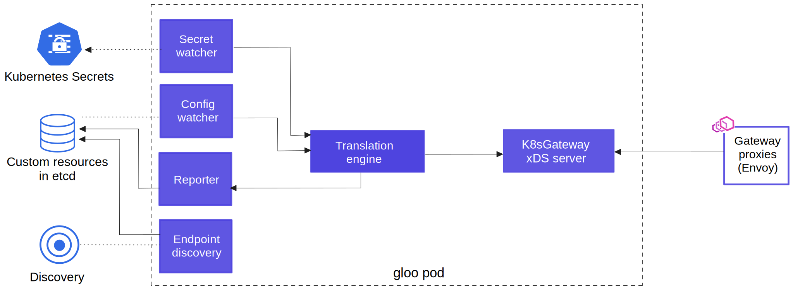

<h1 align="center">
  <picture>
    <source media="(prefers-color-scheme: dark)" srcset="docs/content/img/k8sgateway/logo-dark.svg" alt="K8sGateway" width="800">
    <source media="(prefers-color-scheme: light)" srcset="docs/content/img/k8sgateway/logo.svg" alt="K8sGateway" width="800">
    
  </picture>
   
  An Envoy-Powered Kubernetes-Native API Gateway
</h1>

# 🚧 NOTE: This project is in the process of being donated to the CNCF and is not affiliated with the Kubernetes project. It is being re-factored as part of the process.🚧
Please see [the plan](https://github.com/k8sgateway/k8sgateway/issues/10363) for more information and current status.

## About K8sGateway
K8sGateway is a feature-rich, fast, and flexible Kubernetes-native ingress controller and next-generation API gateway that is built on top of [Envoy proxy](https://www.envoyproxy.io) and the Kubernetes Gateway API. It excels in function-level routing, supports legacy apps, microservices and serverless, offers robust discovery capabilities, integrates seamlessly with open-source projects, and is designed to support hybrid applications with various technologies, architectures, protocols, and clouds.

[**Installation**](https://k8sgateway.io/docs/quickstart/) &nbsp; |
&nbsp; [**Documentation**](https://k8sgateway.io/docs) &nbsp; |
&nbsp; [**Blog**](https://k8sgateway.io/docs/) &nbsp; |
&nbsp; [**Slack**](https://cloud-native.slack.com/archives/C080D3PJMS4) &nbsp; |

 

### Using K8sGateway
- **Kubernetes Gateway API**: K8sGateway is a feature-rich ingress controller, built on top of the Envoy Proxy and fully conformant with the Kubernetes Gateway API.
- **Next-generation API gateway**: K8sGateway provides a long list of API gateway features including rate limiting, circuit breaking, retries, caching, transformation, service-mesh integration, security, external authentication and authorization.
- **Hybrid apps**: K8sGateway creates applications that route to backends implemented as microservices, serverless functions and legacy apps. This feature can help users to
  * Gradually migrate from their legacy code to microservices and serverless.
  * Add new functionalities using cloud-native technologies while maintaining their legacy codebase.
  * Allow different teams in an organization choose different architectures.

<!---
PLEASE DO NOT RENAME THIS SECTION
This header is used as an anchor in our CNCF Donation Issue
-->
### What makes K8sGateway unique
- **Function-level routing allows integration of legacy applications, microservices and serverless**: K8sGateway can route requests directly to functions. Request to Function can be a serverless function call (e.g. Lambda, Google Cloud Function, OpenFaaS Function, etc.), an API call on a microservice or a legacy service (e.g. a REST API call, OpenAPI operation, XML/SOAP request etc.), or publishing to a message queue (e.g. NATS, AMQP, etc.). This unique ability is what makes K8sGateway the only API gateway that supports hybrid apps as well as the only one that does not tie the user to a specific paradigm.
- **K8sGateway incorporates vetted open-source projects to provide broad functionality**: K8sGateway supports high-quality features by integrating with top open-source projects, including gRPC, OpenTracing, NATS and more. K8sGateway's architecture allows rapid integration of future popular open-source projects as they emerge.
- **Full automated discovery lets users move fast**: Upon launch, K8sGateway creates a catalog of all available destinations and continuously keeps them up to date. This takes the responsibility for 'bookkeeping' away from the developers and guarantees that new features become available as soon as they are ready. K8sGateway discovers across IaaS, PaaS and FaaS providers as well as Swagger, and gRPC.

## Next Steps
- Join us on our Slack channel: [#k8sgateway](https://cloud-native.slack.com/archives/C080D3PJMS4)
- Check out the docs: [https://k8sgateway.io/docs](https://k8sgateway.io/docs)

## Contributing to K8sGateway
The [devel](devel) folder should be the starting point for understanding the code, and contributing to the product.

## Thanks
**K8sGateway** would not be possible without the valuable open-source work of projects in the community. We would like to extend a special thank-you to [Envoy](https://www.envoyproxy.io).

## Security
*Reporting security issues* : We take K8sGateway's security very seriously. If you've found a security issue or a potential security issue in K8sGateway, please DO NOT file a public Github issue, instead follow the directions laid out in the [k8sgateway/community respository](https://github.com/k8sgateway/community/blob/main/CVE.md).
