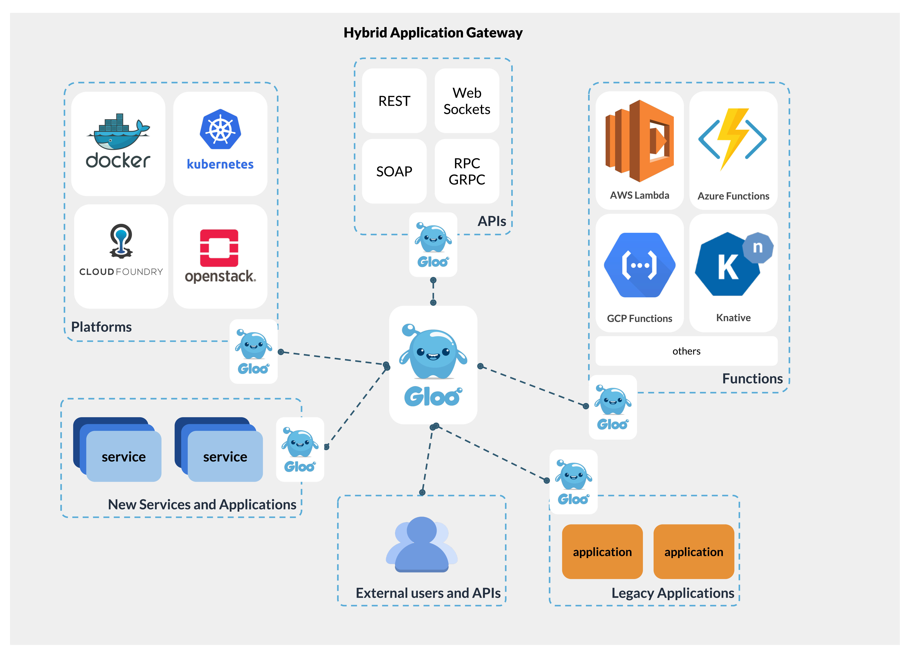

<h1 align="center">
    
   
  The Hybrid App Gateway
</h1>

Gloo is a feature-rich Kubernetes-native ingress controler and next-generation API gateway. Gloo is exceptional in its function-level routing; its support for legacy apps, microservices and serverless; its discovery capabilities; its numerous features; and its tight integration with leading open-source projects. Gloo is unqieuly designed to support hybrid applications, in which multiple technologies, architectures, protocols, and clouds can coexist. 

[**Installation**](docs/installation/kubernetes.md) &nbsp; |
&nbsp; [**Developers**](docs/dev/README.md) &nbsp; |
&nbsp; [**Documentation**](https://gloo.solo.io) &nbsp; |
&nbsp; [**Blog**](https://medium.com/solo-io/announcing-gloo-the-function-gateway-3f0860ef6600) &nbsp; |
&nbsp; [**Slack**](https://slack.solo.io) &nbsp; |
&nbsp; [**Twitter**](https://twitter.com/soloio_inc)

 

## Summary

- [**Using Gloo**](#using-gloo)
- [**What makes Gloo unique**](#what-makes-gloo-unique)
- [**Features**](#features)
- [**Roadmap**](#Roadmap)
- [**Vision**](#vision)

## Using Gloo
- **Kubernetes ingress controler**: Gloo can function as a feature-rich ingress controler, built on top of the Envoy Proxy. 
- **Next-generation API gateway** : Gloo provides a long list of API gateway features, including rate limiting, circuit breaking, retries, caching, external authentication and authorization, transformation, service-mesh integation, and security. 
- **Hybrid apps**: Gloo creates applications that route to backends implemented as microservices, serverless functions, and legacy apps. This feature can help users to gradually migrate from their legacy code to microservices and serverless; can let users add new functionalities using cloud-native technologies while maintaining their legacy codebase; can be used in cases where different teams in an organization choose different architectures; and more. See [here](https://www.solo.io/hybrid-app) for more on the Hybrid App paradigm. 

## What makes Gloo unique
- **Function-level routing allows integration of legacy applications, microservices and serverless**: Gloo can route requests directly to _functions_, which can be a serverless function call (e.g. Lambda, Google Cloud Function, OpenFaaS function, etc.), an API call on a microservice or a legay service (e.g. a REST API call, OpenAPI operation, XML/SOAP request etc.), or publishing to a message queue (e.g. NATS, AMQP, etc.). This unique ability is what makes Gloo the only API gateway that supports hybrid apps, as well as the only one that does not tie the user to a specific paradigm. 
- **Gloo incorporates vetted open-source projects to provide broad functionality**: Gloo support high-quality features by integrating with top open-source projets, including GRPC, GraphQL, OpenTracing, NATS and more. Gloo's architecture allows rapid integration of future popular open-source projects as they emerge. 
- **Full atomated discovery lets users move fast**: Upon launch, Gloo creates a catalog of all available destinations, and continuously maintains it up to date. This takes the responsibility for 'bookeeping' away from the developers, and gurantees that new feature become available as soon as they are ready. Gloo discovers across IaaS, PaaS and FaaS providers, as well as Swager, GRPC, and GraphQL. 
- **Gloo integrates intimately with the user's environment**: with Gloo, users are free to choose their favorite tools for scheduling (such as K8s, Nomad, OpenShift, etc), persistance (K8s, Consul, etcd, etc) and security (K8s, Vault). 

    
## Features

**Supported Platforms**:

- Kubernetes

- HashiCorp Stack (Vault, Consul, Nomad)

- AWS Lambda

- Knative

- Microsoft Azure Functions

- Google Cloud Platform Functions

**Routing Features**:

- **Dynamic Load Balancing**: Load balance traffic across multiple upstream services.

- **Health Checks**: Active and passive monitoring of your upstream services.

- **OpenTracing**: Monitor requests using the well-supported OpenTracing standard

- **Monitoring**: Export HTTP metrics to Prometheus or Statsd

- **SSL**: Highly customizable options for adding SSL encryption to upstream services with full support for SNI.

- **Transformations**: Add, remove, or manipulate HTTP requests and responses.

- **Automated API Translation**: Automatically transform client requests to upstream API calls using Gloo’s Function Discovery

- **CLI**: Control your Gloo cluster from the command line.

- **Declarative API**: Gloo features a declarative YAML-based API; store your configuration as code and commit it with your projects.

- **Failure Recovery**: Gloo is completely stateless and will immediately return to the desired configuration at boot time.

- **Scalability**: Gloo acts as a control plane for Envoy, allowing Envoy instances and Gloo instances to be scaled independently. Both Gloo and Envoy are stateless.

- **Performance**: Gloo leverages Envoy for its high performance and low footprint.

- **Plugins**: Extendable architecture for adding functionality and integrations to Gloo.

- **Tooling**: Build and Deployment tool for customized builds and deployment options

- **Events**: Invoke APIs using CloudEvents.

- **Pub/Sub**: Publish HTTP requests to NATS

- **JSON-to-gRPC transcoding**: Connect JSON clients to gRPC services

Blogs & Demos
-----
- [Announcement Blog](https://medium.com/solo-io/announcing-gloo-the-function-gateway-3f0860ef6600)
- [Building hybrid app demo](https://www.youtube.com/watch?time_continue=1&v=ISR3G0CAZM0)

Community
-----
Join us on our slack channel: [https://slack.solo.io/](https://slack.solo.io/)

---

### Thanks

**Gloo** would not be possible without the valuable open-source work of projects in the community. We would like to extend a special thank-you to [Envoy](https://www.envoyproxy.io).

