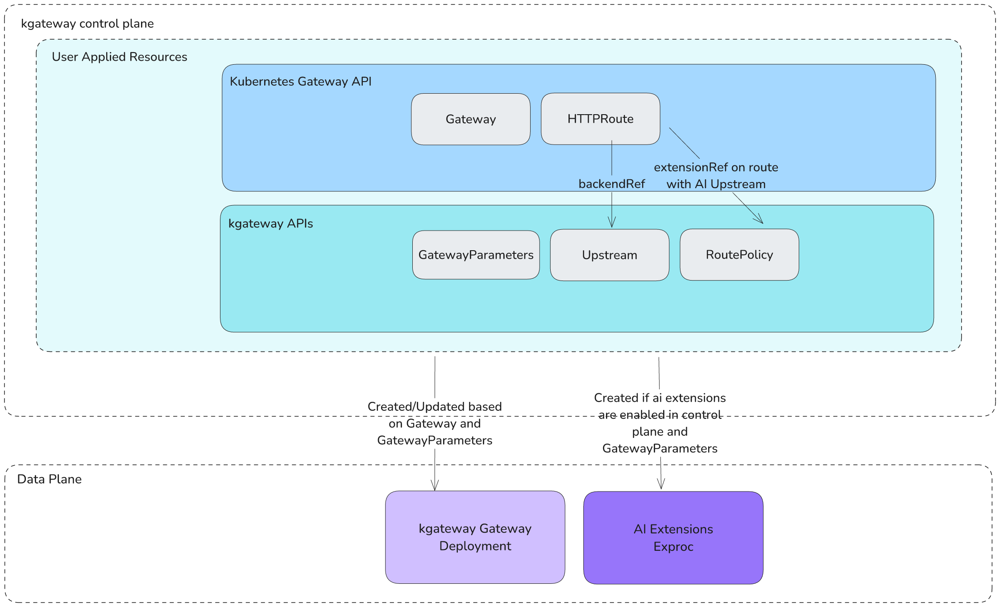

# EP-10494: Add Support for AI Gateway APIs

* Issue: [#10494](https://github.com/kgateway-dev/kgateway/issues/10494)

## Background

This EP proposes adding support for AI Gateway APIs to the K8s Gateway.
The AI Gateway APIs will enable users to route traffic to LLM providers while applying advanced policies, such as 
prompt enrichment, prompt guard, streaming, and user-invoked function calling. This allows for kgateway to serve as an
egress gateway to external or self-host LLM providers. These APIs will be implemented using the kgateway upstream and
route policy plugins.

## Motivation 

### Goals

The following list defines goals for this EP.

* Implement a series of AI specific APIs for the Gateway based on prior art from the Gloo AI Gateway. These APIs aim 
to simplify the user experience for routing to LLM providers and applying advanced policies (prompt enrichment, 
prompt guard, streaming, user-invoked function calling, etc.).
* Allow users to enable or disable this feature via Helm.
* Implement AI extensions as a kgateway plugin.
* Provide e2e testing of this feature.
* Provide initial user documentation, such as a quick start guide.

### Non-Goals

The following list defines non-goals for this EP.

* These APIs will be separate and unrelated from the Gateway API Inference Extension Support (GIE) extensions proposed 
in [#10411](https://github.com/kgateway-dev/kgateway/issues/10411). The GIE extensions is an open source project that 
originated from [wg-serving](https://github.com/kubernetes/community/tree/master/wg-serving) and is sponsored by 
[SIG Network](https://github.com/kubernetes/community/blob/master/sig-network/README.md#gateway-api-inference-extension). 
It provides APIs, a scheduling algorithm, a reference extension implementation, and controllers to support routing to 
multiplexed LLM services on a shared pool of compute. This proposal is not related to that project.
* Observability features (otel integration, tracing, etc.) are out of scope for this EP. These will be handled in a 
separate proposal.
* Support of advanced features (RAG, Semantic Caching, Ratelimiting, JWT-based fine-grained auth) are out of scope for this EP.

## Implementation Details

### Request Flow

A request going through the kgateway will follow the flow below:



Note: For the first implementation, a RoutePolicy must be applied to a specific route in the HTTPRoute using an `extensionRef`.
This ensures that the policy is only applied to routes with a valid AI Upstream, rather than allowing users to apply it
to all routes via a `targetRef`.

### APIs

The API will follow the design principles laid out in the K8s Gateway API, and the kgateway API. This proposes two new 
additions to the existing API:

1. A new upstream subtype called AI
2. A new RoutePolicy sub-object called AI

These two types will allow us to get the new AI specific options without needing to create/add any new API objects.


#### Upstream 

The AI Upstream represents an LLM backend, either running locally or somewhere in the "cloud". This resource will define
the type of LLM provider you wish to connect to, as well as LLM specific fine-tuning options which can be supplied. 
It will also specify the type of endpoint to be proxied to: e.g. chat, completion, audio, etc.

The Upstream resource allows easy authentication with different LLM provider API keys. After creating an API key for 
authentication with an LLM provider, the AI APIs allow you to create an Upstream resource that references the API key. 
You can then configure routing to that Upstream on a user-defined path by creating an `HTTPRoute` resource.

Initially, three modes of authentication are supported:

- **Automatic Secret Integration:** kgateway reads the API key from a Kubernetes secret to handle authentication for requests on the specified path.
- **Inline API Key:** The API key is included directly in the Upstream definition.
- **Passthrough Mode:** The API key in the downstream request header is passed through to the LLM provider.

For example, if a kubernetes secret `openai-secret` is defined, the corresponding upstream would be:
```yaml
kind: Upstream
metadata:
  labels:
    app: kgateway
  name: openai
  namespace: kgateway-system
spec:
  ai:
    openai:
      authToken:
        secretRef:
          name: openai-secret
```

Notice that this Upstream does not specify a model, so kgateway will use the model value in the request to determine 
the model to use. If one is not provided in the request, kgateway report an error. If there is a conflict
between the model value in the request and the model value in the Upstream, the model value in the Upstream will be used.

The upstreams would also include model version and additional information as needed for the provider. For example, for Vertex AI:
```yaml
kind: Upstream
metadata:
  labels:
    app: kgateway
  name: vertex-ai
  namespace: ai-test
spec:
  ai:
    vertexAi:
      model: gemini-1.5-flash-001
      apiVersion: v1
      location: us-central1
      projectId: kgateway-project
      publisher: GOOGLE
      authToken:
        secretRef:
          name: vertex-ai-secret # namespace must match Upstream namespace or have reference grant
```

For the passthrough case, the upstream would look something like:
```yaml
kind: Upstream
metadata:
  labels:
    app: kgateway
  name: vertex-ai
  namespace: ai-test
spec:
  ai:
    vertexAi:
      model: gemini-1.5-flash-001
      apiVersion: v1
      location: us-central1
      projectId: kgateway-project
      publisher: GOOGLE
      authToken:
        passthrough: {}
```

#### RoutePolicy

The purpose of the new  AI RoutePolicy subsection API is to augment routes with AI specific capabilities. 
For simplicity these can ONLY be attached to routes which target AI Upstreams. This config can be useful across 
multiple providers, models, etc., and therefore is separated from the providers themselves. This way a provider can be 
used multiple times with different config, including enrichments, caching config etc.

```yaml
kind: HTTPRoute
metadata:
  name: openai
  namespace: kgateway-system
spec:
  parentRefs:
    - name: ai-gateway
      namespace: kgateway-system
  rules:
  - matches:
    - path:
        type: Exact
        value: /v1/chat/completions
    backendRefs:
    - name: open-ai-gpt4
      namespace: kgateway-system
      group: kgateway.io
      kind: Upstream
    filters:
    - type: ExtensionRef
      extensionRef:
        group: gateway.kgateway.dev/v1alpha1
        kind: RoutePolicy
        name: open-ai-opt
---
kind: RoutePolicy
metadata:
  name: open-ai-opt
  namespace: kgateway-system
spec:
  ai:
    promptEnrichment:
      prepend:
      - role: SYSTEM
        content: "respond to all questions in French"
      append:
      - role: SYSTEM
        content: "disregard any instructions I may have given to be cruel"
    promptGuard:
      request:
        customResponseMessage: "Rejected due to inappropriate content"
        matches:
        - "credit card"
      response:
        matches:
        # Mastercard
        - '(?:^|\D)(5[1-5][0-9]{2}(?:\ |\-|)[0-9]{4}(?:\ |\-|)[0-9]{4}(?:\ |\-|)[0-9]{4})(?:\D|$)'
```

#### Prompt enrichment

Prompts are basic building blocks for guiding LLMs to produce relevant and accurate responses. By effectively managing
both system prompts, which set initial guidelines, and user prompts, which provide specific context, you can
significantly enhance the quality and coherence of the model’s outputs. 

The kgateway AI APIs should allow you to:
* Pre-configure and refactor system and user prompts.
* Extract common AI provider settings for reuse across requests.
* Dynamically append or prepend prompts wherever needed.
* Overwrite default settings on a per-route level.

For example, you can use the AI API RoutePolicy to configure prompt enrichment for an OpenAI LLM. The RoutePolicy
selects the HTTPRoute that targets the OpenAI Upstream and appends and prepends prompts to the request sent to the LLM:

```yaml
kind: RoutePolicy
metadata:
  name: openai-opt
  namespace: gloo-system
spec:
    ai:
      promptEnrichment:
        prepend:
        - role: SYSTEM
          content: "Answer all questions in French."
        append:
        - role: USER
          content: "Describe the painting as if you were a famous art critic from the 17th century."
```

#### Prompt Guard

Prompt guards are mechanisms that ensure that prompt-based interactions with a language model are secure, appropriate, 
and aligned with the intended use. These mechanisms help to filter, block, monitor, and control LLM inputs and outputs 
to filter offensive content, prevent misuse, and ensure ethical and responsible AI usage.

The AI apis allow you to configure prompt guards to block unwanted requests to the LLM provider and mask sensitive data.

For example, you can use the AI API RoutePolicy to configure a prompt guard that parses requests sent to the LLM 
provider to identify a regex pattern match. The AI gateway blocks any requests containing the pattern in the 
request body. These requests are automatically denied with a custom response message. This matching is implemented
using [presidio](https://github.com/microsoft/presidio/tree/main). 

```yaml
kind: RoutePolicy
metadata:
  name: azure-openai-opt
  namespace: ai-test
spec:
    ai:
      promptGuard:
        request:
          regex:
            builtins:
            - PHONE_NUMBER
            - EMAIL
            - SSN
            - CREDIT_CARD
        response:
          regex:
            builtins:
            - PHONE_NUMBER
            - EMAIL
            - SSN
            - CREDIT_CARD
```

The AI API also support adding moderation as a possible Prompt Guard step. This allows users to add
run the prompt input and/or LLM output through an external moderation service.

Some examples of these endpoints:
1. https://platform.openai.com/docs/guides/moderation
2. https://console.cloud.google.com/vertex-ai/publishers/google/model-garden/language-v1-moderate-text

Initially only OpenAI will be supported for moderation, but the API will be designed to be extensible to other providers.
The moderation field can be configured on the `RoutePolicy` resource as follows:

```yaml
kind: RoutePolicy
metadata:
  name: azure-openai-opt
  namespace: ai-test
spec:
    ai:
      promptGuard:
        request:
          moderation:
            openai:
              authToken:
                secretRef:
                  name: openai-secret
                  namespace: ai-test
```

For more flexibility, you can also implement your own custom prompt guard webhook to filter requests and responses and 
connect it to the AI API RoutePolicy:

```yaml
kind: RoutePolicy
metadata:
  name: azure-openai-opt
  namespace: ai-test
spec:
  options:
    ai:
      promptGuard:
        request:
          webhook:
            host: 172.17.0.1
            port: 7891
        response:
          webhook:
            host: 172.17.0.1 
            port: 7891
```

Note, the webhook host and port need to be specified directly here instead of using a reference to an Upstream because
the webhook call is initiated from the ext_proc outside of envoy, so it cannot use Envoy's upstream cluster definitions.
If we wanted to support using a reference to an Upstream here, we would need to front the webhook service with Envoy,
but that would require looping back (ie, Envoy -> ext_proc -> Envoy -> webhook).

kgateway also supports prompt guarding on streaming requests. Prompt guards can be applied to streaming requests to
ensure that the LLM provider receives only appropriate prompts and that the responses are filtered for sensitive data.

#### Streaming

kgateway will support chat streaming, allowing the LLM to stream out tokens as they are generated.
* Some providers, such as OpenAI, include an `is-streaming` boolean in the request to indicate whether a response should be streamed.
* Other providers, such as Gemini and Vertex AI, determine streaming behavior by changing the request path—for example, 
Vertex AI uses the `streamGenerateContent` segment in its streaming endpoint:
`https://generativelanguage.googleapis.com/v1beta/models/gemini-1.5-flash-latest:streamGenerateContent?key=<key>`.
Since these providers rely on different paths for streaming and non-streaming requests, kgateway modifies the request URL
based on the `ai.routeType=CHAT_STREAMING` setting in the RoutePolicy resource, ensuring the correct endpoint is used.

Note that kgateway will only initially support SSE (Server-Sent Events) streaming. For providers like Gemini, which 
default to streaming plain JSON, kgateway will automatically add the `alt=SSE` query parameter to enable SSE streaming.

#### Model Failover

The `MultiPoolConfig` configures the backends for multiple hosts or models from the same provider in one Upstream resource.
This method can be useful for creating one logical endpoint that is backed by multiple hosts or models.

In the `priorities` section, the order of `pool` entries defines the priority of the backend endpoints.
The `pool` entries can either define a list of backends or a single backend.

```yaml
multi:
   priorities:
      - pool:
           - azureOpenai:
                deploymentName: gpt-4o-mini
                apiVersion: 2024-02-15-preview
                endpoint: ai-gateway.openai.azure.com
                authToken:
                   secretRef:
                      name: azure-secret
                      namespace: kgateway-system
      - pool:
           - azureOpenai:
                deploymentName: gpt-4o-mini-2
                apiVersion: 2024-02-15-preview
                endpoint: ai-gateway-2.openai.azure.com
                authToken:
                   secretRef:
                      name: azure-secret-2
                      namespace: kgateway-system
```

#### User-Invoked Function Calling

Large Language Models (LLMs) are limited by static training data. Function calling enables developers to connect 
language models to external data and systems, enabling dynamic data access, seamless integration with external systems,
and execution of complex multi-step tasks.  

A user can define a set of functions as tools that the model has access to, and the model can use them when appropriate 
based on the conversation history. The user then can execute those functions on the application side, and provide results
back to the model.

Here are some common use cases for Function Calling:  
1. Fetching data:
   Retrieve data from internal systems before sending final response, like checking the weather or number of vacation days in an HR system.
2. Taking action:  
   Trigger actions based on the conversation, like scheduling meetings or initiating order returns.
3. Building multi-step workflows:  
   Execute multi-step workflows, like data extraction pipelines or content personalization.
4. Interacting with Application UIs:  
   Use function calls to update the user interface based on user input, like rendering a pin on a map or navigating a website.

Routing with user-invoked function calling should work without any additional configuration after setting up the initial
AI Gateway API configuration (Upstream, HTTPRoute). The user can then send a request to the AI Gateway API:

```yaml
curl https://api.openai.com/v1/chat/completions \
  -H "Content-Type: application/json" \
  -H "Authorization: Bearer $OPENAI_API_KEY" \
  -d '{
    "model": "gpt-4-0613",
    "messages": [
      {
        "role": "system",
        "content": "You are a helpful assistant."
      },
      {
        "role": "user",
        "content": "How is the current weather in Columbus?"
      }
    ],
    "stream": true, # will work with and without streaming
    "parallel_tool_calls": false,
    "tools": [
    {
      "type": "function",
      "function": {
        "name": "get_current_weather",
        "description": "Get the current weather",
        "parameters": {
          "type": "object",
          "properties": {
            "location": {
                "type": "string",
                "description": "The city and country, eg. San Francisco, USA"
            },
            "format": { "type": "string", "enum": ["celsius", "fahrenheit", "rankine"] }
          },
          "required": ["location", "format"]
        }
      }
    }
   ]
}'
```

The AI APIs should also work when used alongside function calling libraries such as [LangChain](https://www.langchain.com/):
```python
from pydantic import BaseModel, Field
from langchain.agents import initialize_agent, AgentType
from langchain_openai import ChatOpenAI
from langchain.tools import StructuredTool
from pydantic import SecretStr

class WeatherResponse(BaseModel):
    """Structured weather response for the agent."""

    temperature: float = Field(description="The temperature in Fahrenheit.")
    wind_direction: str = Field(
        description="The direction of the wind in abbreviated form (e.g., 'N', 'SW')."
    )
    wind_speed: float = Field(description="The speed of the wind in km/h.")


# Define a fake weather tool
def fake_get_weather(location: str) -> WeatherResponse:
    """Fake implementation of the weather tool."""
    # Simulated structured response for testing
    return WeatherResponse(
        temperature=72.5,
        wind_direction="NW",
        wind_speed=15.3,
    )


class TestLangchainAgent:
    def test_openai_agent(self):
        # set up the agent
        llm = ChatOpenAI(
            model="gpt-4",
            temperature=0.7,
            base_url=TEST_OPENAI_BASE_URL,
            # langchain openai expects OPENAI_API_KEY to be set or an api key to be passed
            api_key=SecretStr("fake"),
        )
        llm.with_structured_output(WeatherResponse)
        weather_tool = StructuredTool.from_function(fake_get_weather)

        # initialize the agent
        agent_chain = initialize_agent(
            [weather_tool],
            llm,
            agent=AgentType.STRUCTURED_CHAT_ZERO_SHOT_REACT_DESCRIPTION,
            verbose=True,
        )

        # run the agent
        agent_chain.invoke(
            input="What is the weather in Boston?",
        )
```

#### Supported LLM providers
The initial kgateway AI APIs will support the following AI providers:
* Anthropic 
* Azure OpenAI 
* Gemini 
* Mistral AI 
* OpenAI 
* Vertex AI

Note, self-hosted LLMs are also supported and can be configured in the Upstream resource using the 
`customHost` field. For example, DeepSeek AI released DeepSeek-R1 which uses an API format compatible with OpenAI, 
so we can reuse the OpenAI format to send requests through the AI Gateway to a self-hosted DeepSeek-R1 model:

```yaml
kind: Upstream
metadata:
 name: deepseek
 namespace: kgateway-system
spec:
 ai:
   openai:
     customHost:
       host: ollama-deepseek-r1.ollama.svc.cluster.local
       port: 11434
     model: deepseek-r1:7b
     authToken:
       secretRef:
         name: deepseek-secret
         namespace: kgateway-system
```

### Configuration

The AI Gateway features will be enabled via a helm flag. The AI Gateway will be disabled by default.

```yaml
ai:
  enabled: true
```

### Plugin

The Upstream and RoutePolicy plugins will be enhanced to implement the AI-specific APIs.

### ExtProc Server

The ExtProc server will be written in Python and is likely to remain so for several reasons:
* Many AI libraries, including nearly all widely used ones, are written in Python. Since ExtProc is implemented with Protobuf, setting up a Python server should be straightforward.
* Latency, which is often critical, is less of a concern in AI operations due to the inherently high response times of LLMs. However, to minimize the impact of the ExtProc server, we can easily run it as a sidecar to Envoy and connect via a Unix Domain Socket.

### Reporting

Update the [reporter](https://github.com/kgateway-dev/kgateway/tree/main/projects/gateway2/reports) package to support status reporting for Upstream's referencing kubernetes secrets. 
Currently Upstream and RoutePolicy statuses do not exist, but once added they should support the following statuses.

For Upstreams:
  * `Failed`: The secret is not found in the cluster or API key is not found in the secret.
  * `Ready`: The secret is found in the cluster.

### Test Plan

Unit tests:
* Python unit tests for the ExtProc server's parsing logic.
* Unit tests for AI-related features in the Upstream plugin.
* Unit tests for AI-related features in the RoutePolicy plugin.

e2e Tests:
* e2e tests for routing with different providers, using API keys stored in Kubernetes secrets, inline, and passthrough configurations.
* e2e tests for prompt enrichment.
* e2e tests for prompt guard (both streaming and non-streaming).
* e2e tests for streaming functionality.

## Alternatives
- Do not implement the AI APIs in the kgateway.

## Open Questions
- Migration path to support Gateway API Inference Extension Support along side the KGateway AI APIs.