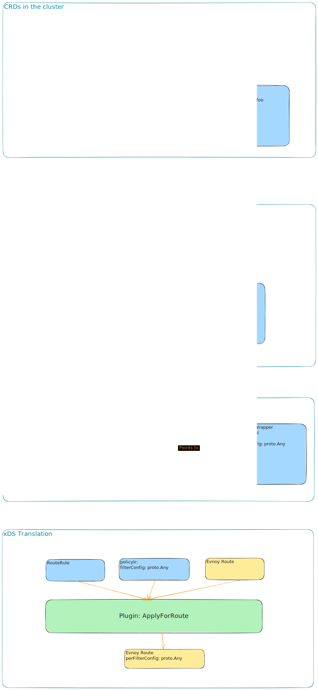

# Architecture
Kgateway is a control plane for envoy based on the Kubernetes Gateway API. This means that we translate K8s objects like Gateways, HTTPRoutes, Services, EndpointSlices and user policy into envoy configuration.

Our goals with the architecture of the project are to make it scalable and extendable.

To make the project scalable, it's important to keep the computation minimal when changes occur. For example, when a pod changes, or a policy is updated, we do the minimum amount of computation to update the envoy configuration.

With extendability, kgateway is the basis on top of which users can easily add their own custom logic. To that end, we have a plugin system that allows users to add their own custom logic to the control plane in a way that's opaque to the core code.


Going down further, to enable these goals we use a [KRT](https://github.com/istio/istio/tree/master/pkg/kube/krt#krt-kubernetes-declarative-controller-runtime) based system. KRT gives us a few advantages:
- The ability to complement controllers with custom Intermediate Representations (IRs).
- Automatically track object dependencies and changes and only invoke logic that depends on the object that changed.

# CRD Lifecycle

How does a user CRD make it into envoy?

We have 3 main translation lifecycles: Routes & Listeners, Clusters, and Endpoints.

Let's focus on the first one - Routes and Listeners, as this is where the majority of the logic is.

Envoy Routes & Listeners translate from Gateways, HTTPRoutes, and user policies (i.e. RoutePolicy, ListenerPolicy, etc).

## Policies (Contributed by Plugins)

To add a policy to Kgateway, it needs to be contributed through a **plugin**. Each plugin acts as an independent Kubernetes controller that provides kgateway with a **KRT collection of IR policies** (this is done by translating the policy CRD to a policy IR). The second important thing a plugin provides is a function that allocates a **translation pass** for the gateway translation phase. This will be used when doing xDS translation. More on that later.

To add a policy to kgateway we need to 'contribute' it as a plugin. You can think of a plugin as an
independent k8s controller that translates a CRD to a KRT collection of policies in an IR form kgateway can understand (it's called `ir.PolicyWrapper`).
A plugin lifecycle is the length of the program - it doesn't reset on each translation (we will explain later where we hold translation state).

When a plugin can contribute a policy to kgateway, kgateway uses policy collection to perform **policy attachment** - this is the process of assigning policies to the object they impact (like HTTPRoutes) based on their targetRefs.

You can see in the Plugin interface a field called `ContributesPolicies` which is a map of GK -> `PolicyPlugin`.
The policy plugin contains a bunch of fields, but for our discussion we'll focus on these two:

```go
type PolicyPlugin struct {
	Policies       krt.Collection[ir.PolicyWrapper]
	NewGatewayTranslationPass func(ctx context.Context, tctx ir.GwTranslationCtx) ir.ProxyTranslationPass
    // ... other fields
}
```
`Policies` is the collection of policies that the plugin contributes. The plugin is responsible for creating
this collection, usually by starting with a CRD collection, and then translating to a `ir.PolicyWrapper` struct.

Let's look at the important fields in the PolicyWrapper:

```go
type PolicyWrapper struct {
	// The Group, Kind Name, Namespace to the original policy object
	ObjectSource `json:",inline"`
	// The IR of the policy objects. Ideally with structural errors either removed so it can be applied to envoy, or retained and returned in the translation pass (this depends on the defined fallback behavior).
	// Opaque to us other than metadata.
	PolicyIR PolicyIR
	// Where to attach the policy. This usually comes from the policy CRD.
	TargetRefs []PolicyTargetRef
}
```

The system will make use of the targetRefs to attach the policy IR to Listeners and HTTPRoutes. You will then 
get access to the IR during translation (more on that later).

When translating a Policy to a PolicyIR, you'll want to take the translation **as close as you can** to envoy's config structures. For example, if your policy will result in an envoy
PerFilterConfig on a route, the PolicyIR should contain the proto.Any that will be applied there. Doing most of the policy translation at this phase has advantages:
- Policy will only re-translate when the policy CRD changes
- We can expose errors in translation on the policy CRD status as soon as the policy is written (no need to depend on later translation phases).

The second field, `NewGatewayTranslationPass` allocates a new translation state for the
gateway/route translation. This function will be invoked during the Translation to xDS phase, so we will expand on it later.

## HTTPRoutes and Gateways

HTTPRoutes and Gateways are handled by kgateway. Kgateway builds an IR for HTTPRoutes and Gateways, that looks very similar to 
the original object, but in additional has an `AttachedPolicies` struct that contains all the policies that are attached to the object.

Kgateway uses the `TargetRefs` field in the PolicyWrapper (and `extensionRefs` in the Route objects) to opaquely attach the policy to the HTTPRoute or Gateway.

## Translation to xDS

When we reach this phase, we already have the Policy -> IR translation done; and we have all the HTTPRoutes and Gateways in IR form with the policies attached to them.

The translation to xDS has 2 phases:
- The first phase aggregates all the HTTPRoutes for a single Gateway into a single Gateway IR object with all the policies and routes inside it. This resolves delegation, and merges HTTPRoutes based on the Gateway API spec. The phase uses KRT to track the dependencies of the routes and gateways (for example, ssl certs). Recall that by the time we get here, policy attachment was already performed (i.e. policies will already be in the AttachedPolicies struct).
- The second phase translates the Gateway IR to envoy configuration. It does not use KRT, as all the dependencies are resolved in the first phase, and everything needed for translation is in the Gateway IR. At this phase the **policy plugins** are invoked.

Having these 2 phases has these advantages:
- The second phase is simple and fast, as all the dependencies are resolved in the previous phases.
- We can create alternative translators for the Gateway IR, for example, to translate a waypoint.


At the beginning of the translation of the Gateway IR to xDS, we take all the contributed policies and allocate a `NewGatewayTranslationPass` for each of them. This will hold the state for the duration of the translation. 

This allows us, for example, to translate a route, and in response to that hold state that tells us to add an http filter.

When it translates Gateway API route rules to envoy routes, it reads the `AttachedPolicies` and calls the appropriate function in the `ProxyTranslationPass` and passes in 
the attached policy IR. This lets the policy plugin code modify the route or listener as needed, based on the policy IR (add filters, add filter route config, etc..).
Then policy plugins are invoked with the attached policy IR, and can modify the envoy protobufs as needed.

# Diagram of the translation lifecycle

