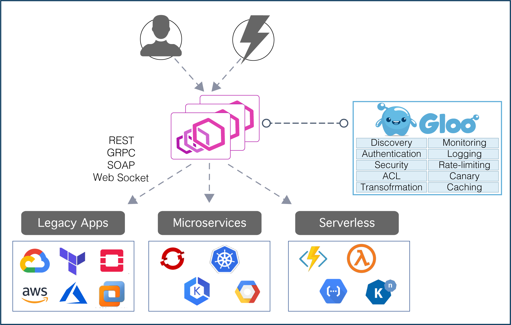

<h1 align="center">
    
   
  An Envoy-Powered API Gateway
</h1>

Gloo is a feature-rich, Kubernetes-native ingress controller, and next-generation API gateway. Gloo is exceptional in its function-level routing; its support for legacy apps, microservices and serverless; its discovery capabilities; its numerous features; and its tight integration with leading open-source projects. Gloo is uniquely designed to support hybrid applications, in which multiple technologies, architectures, protocols, and clouds can coexist. 

[**Installation**](installation/) &nbsp; |
&nbsp; [**Developers**](dev/) &nbsp; |
&nbsp; [**Blog**](https://medium.com/solo-io/announcing-gloo-the-function-gateway-3f0860ef6600) &nbsp; |
&nbsp; [**Slack**](https://slack.solo.io) &nbsp; |
&nbsp; [**Twitter**](https://twitter.com/soloio_inc)

 

Blogs & Demos
-----
- [Announcement Blog](https://medium.com/solo-io/announcing-gloo-the-function-gateway-3f0860ef6600)
- [Building hybrid app demo](https://www.youtube.com/watch?time_continue=1&v=ISR3G0CAZM0)

Community
-----
- Join us on our Slack channel: [https://slack.solo.io/](https://slack.solo.io/)
- Follow us on Twitter: [https://twitter.com/soloio_inc](https://twitter.com/soloio_inc)

---

### Thanks

**Gloo** would not be possible without the valuable open-source work of projects in the community. We would like to extend a special thank-you to [Envoy](https://www.envoyproxy.io).

