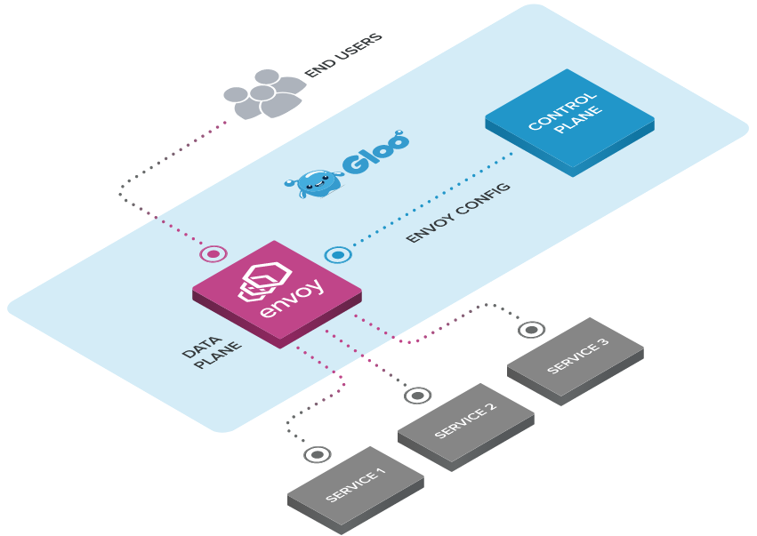

# An Envoy-Powered API Gateway

## What is Gloo

Gloo is a feature-rich, Kubernetes-native ingress controller, and next-generation API gateway. Gloo is exceptional in its function-level routing; its support for legacy apps, microservices and serverless; its discovery capabilities; its numerous features; and its tight integration with leading open-source projects. Gloo is uniquely designed to support hybrid applications, in which multiple technologies, architectures, protocols, and clouds can coexist.

## Next Generation API Gateway

Although the idea of the API Gatway has been around for a bit, [the role of the API Gateway is going through an identity crisis](https://medium.com/solo-io/api-gateways-are-going-through-an-identity-crisis-d1d833a313d7) as we adopt more automated, self-service, platforms like Kubernetes, Cloud Foundry, and public-cloud. Your existing API Management solutions weren't built for highly dynamic environments like Kubernetes and require a lot of additional infrastructure to keep up, highly-available, and production ready. Additionally, a lot of organizations have deployed these pieces of infrastructure in a highly centralized way that plays to the assumptions of the solution and not the desires of the the organization.

When we say Gloo is a "next-generation" gateway, we mean it was purpose-built for a highly dynamic, ephemeral environment like Kubernetes (or other workload orchestration platforms) and is built with the assumption of decentralized ownership. Gloo can provide powerful API Gateway functionality for both existing, on-premises investments (like VM deployments or physical hardware), as well as Kubernetes, and even including forward-leaning compute options like Function as a Service. Legacy API Management vendors would have to completely re-write their solutions to play nicely in this new cloud-native world.

## Getting to know Gloo

* [**Installation**](installation/)
* [**Developers**](dev/)
* [**Blog**](https://medium.com/solo-io/announcing-gloo-the-function-gateway-3f0860ef6600)
* [**Slack**](https://slack.solo.io)
* [**Twitter**](https://twitter.com/soloio_inc)

## Blogs & Demos

* [Announcement Blog](https://medium.com/solo-io/announcing-gloo-the-function-gateway-3f0860ef6600)
* [Building hybrid app demo](https://www.youtube.com/watch?time_continue=1&v=ISR3G0CAZM0)

## Community

* Join us on our Slack channel: [https://slack.solo.io/](https://slack.solo.io/)
* Follow us on Twitter: [https://twitter.com/soloio_inc](https://twitter.com/soloio_inc)

---

## Thanks

Gloo would not be possible without the valuable open-source work of projects in the community. We would like to extend a special thank-you to [Envoy](https://www.envoyproxy.io).
