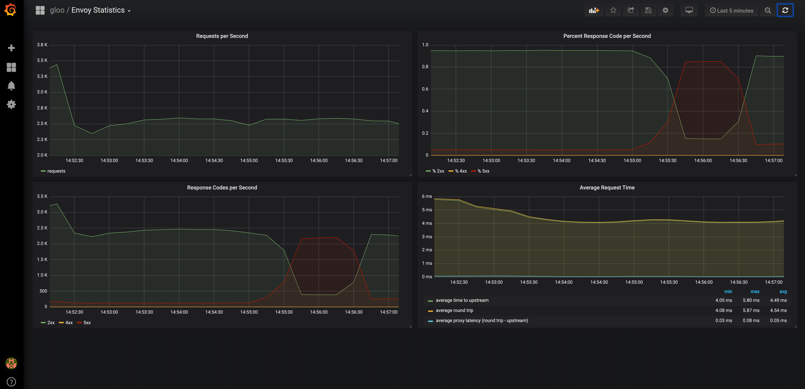

{}
Gloo Edge default prometheus server and grafana instance are not meant to be used `as-is` in production. Please provide your own instance or configure the provided one with production values
{}

Gloo Edge exposes a lot of metrics from both the data plane (Envoy) as well as the control plane components. 
These metrics are available in Open Source Gloo Edge, and can be scraped into a standard metrics backend like Prometheus. 

Enterprise Gloo Edge comes with a few extra enhancements around observability. First, it installs by default with a prometheus 
server to scrape all of the Gloo Edge metrics, and a Grafana instance to provide dashboards from those metrics. Alternatively, 
customers may wish to use their own Prometheus and Grafana deployments and integrate Gloo Edge with those.

Gloo Edge Enterprise comes with a built-in grafana dashboard to show a high-level health of the Envoy proxy, 
and also comes with a component called `observability` that dynamically creates a new Grafana dashboard for each Gloo Edge `Upstream`. 

{}

Example dashboard that Gloo Edge provides, showing a service going down briefly and then recovering (click to enlarge):

