[Auth0](https://auth0.com) is an [OpenID Connect](https://openid.net) identity hub. Auth0 can be used to expose a consistent OIDC interface to your applications while allowing your users to authenticate using credentials managed by Auth0.

In this guide we will see how to authenticate users with your application via an OIDC flow that uses Auth0 as the identity provider. This guide is an example to get you started for test purposes with Auth0.  It omits many of the factors that need to be considered for full production deployments.

First, we will use Gloo Edge to expose a simple [httpbin](https://httpbin.org/) Service running on Kubernetes.

Second, we’ll secure the access using Auth0 OIDC.  Auth0 will return a JWT token, and we’ll use Gloo Edge to extract some claims from this token create new headers corresponding to these claims.

Finally, we’ll see how Gloo Edge RBAC rules can be created to leverage the claims contained in the JWT token.

## Expose a Kubernetes Service

### Deploy the Service

Start by deploying the `httpbin` service on a Kubernetes cluster.  

```shell
kubectl apply -f https://raw.githubusercontent.com/istio/istio/master/samples/httpbin/httpbin.yaml
```


This example was created and tested using a GKE cluster running k8s v1.18.12, but other platforms and versions should work as well.


### Verify the Upstream

Gloo Edge discovers Kubernetes services automatically.  So, running the `glooctl get upstreams` command, you should be able to see a new Gloo Edge Upstream `default-httpbin-8000`, based on the naming convention `namespace-serviceName-portNumber`:

```shell
% glooctl get upstreams default-httpbin-8000
```
```shell
+----------------------+------------+----------+------------------------+
|       UPSTREAM       |    TYPE    |  STATUS  |        DETAILS         |
+----------------------+------------+----------+------------------------+
| default-httpbin-8000 | Kubernetes | Accepted | svc name:      httpbin |
|                      |            |          | svc namespace: default |
|                      |            |          | port:          8000    |
|                      |            |          |                        |
+----------------------+------------+----------+------------------------+
```

### Create the Virtual Service

Use `kubectl` to create the following Gloo Edge Virtual Service that will route all requests from domain `glootest.com` to the new Upstream.

```yaml
apiVersion: gateway.solo.io/v1
kind: VirtualService
metadata:
  name: httpbin-auth0-vs
  namespace: gloo-system
spec:
  virtualHost:
    domains:
    - 'glootest.com'
    routes:
    - matchers:
      - prefix: /
      routeAction:
        single:
          upstream:
            name: default-httpbin-8000
            namespace: gloo-system
```

Run the following `glooctl` command to confirm that the new Route was accepted by Gloo Edge.

```shell
% glooctl get virtualservice httpbin-auth0-vs
```
```shell
+------------------+--------------+--------------+------+----------+-----------------+----------------------------------+
| VIRTUAL SERVICE  | DISPLAY NAME |   DOMAINS    | SSL  |  STATUS  | LISTENERPLUGINS |              ROUTES              |
+------------------+--------------+--------------+------+----------+-----------------+----------------------------------+
| httpbin-auth0-vs |              | glootest.com | none | Accepted |                 | / ->                             |
|                  |              |              |      |          |                 | gloo-system.default-httpbin-8000 |
|                  |              |              |      |          |                 | (upstream)                       |
+------------------+--------------+--------------+------+----------+-----------------+----------------------------------+
```

### Configure DNS and Test

Update your `/etc/hosts` file to resolve `glootest.com` by the IP address returned by the `glooctl proxy address` command (without the port number).

```shell
% glooctl proxy address
34.75.13.137

% tail -1 /etc/hosts
34.75.13.137 glootest.com
```

You can now access the application using the `glootest.com` domain. 

{}
If you locally test on kind, you must include the port in all URLs, such as `http://glootest.com:32500/get`. 
{}

```shell
% curl http://glootest.com/get
```
```shell
{
  "args": {},
  "headers": {
    "Accept": "*/*",
    "Content-Length": "0",
    "Host": "glootest.com",
    "User-Agent": "curl/7.64.1",
    "X-Envoy-Expected-Rq-Timeout-Ms": "15000"
  },
  "origin": "10.68.1.7",
  "url": "http://glootest.com/get"
}
```

Note that the `httpbin` service sends back information mirroring the request that we issued.

## Secure the application using HTTPS

In this section, we will begin securing the application by provisioning an https service endpoint.

For test purposes only, we'll begin by creating a self-signed certificate for the `glootest.com` domain.

```shell
% openssl req -x509 -nodes -days 365 -newkey rsa:2048 -keyout tls.key -out tls.crt -subj "/CN=glootest.com"
```
```shell
Generating a 2048 bit RSA private key
...+++
....+++
writing new private key to 'tls.key'
```

Second, we'll create a Kubernetes secret containing this certificate.

```shell
% kubectl create secret tls upstream-tls --key tls.key --cert tls.crt --namespace gloo-system
```
```shell
secret/upstream-tls created
```

Third, we enable HTTPS for our Virtual Service by using `kubectl` to apply the following change. (If you are using Kind, you will need to include the port in the domain names)


apiVersion: gateway.solo.io/v1
kind: VirtualService
metadata:
  name: httpbin-auth0-vs
  namespace: gloo-system
spec:
  sslConfig:
    secretRef:
      name: upstream-tls
      namespace: gloo-system
  virtualHost:
    domains:
    - 'glootest.com'
    routes:
    - matchers:
      - prefix: /
      routeAction:
        single:
          upstream:
            name: default-httpbin-8000
            namespace: gloo-system


Finally, we will use `curl` to confirm that we can access the new https endpoint.

```shell
% curl -k https://glootest.com/get
```
```shell
{
  "args": {},
  "headers": {
    "Accept": "*/*",
    "Content-Length": "0",
    "Host": "glootest.com",
    "User-Agent": "curl/7.64.1",
    "X-Envoy-Expected-Rq-Timeout-Ms": "15000"
  },
  "origin": "10.68.1.7",
  "url": "https://glootest.com/get"
}
```

## Authenticate with Auth0 OIDC

In this section, we will establish an Auth0 account and application, then modify our Gloo Edge configuration to authenticate using Auth0.

### Establish Auth0 Account

If you are an existing Auth0 customer, then this section is optional for you.  But even if you are not an established Auth0 customer, it is easy to establish a free developer account that allows you to complete the integration exercise outlined in this guide.  First, visit the [signup page](https://auth0.com/signup) and walk through their process.  Auth0 provisions a trial account that you can access via a URL like this:  https://manage.auth0.com/dashboard/us/solo-io/, where `solo-io` would be replaced by the Auth0 Tenant Domain name that you choose.  This provides access to an account dashboard and tools to manage Auth0 applications and users.

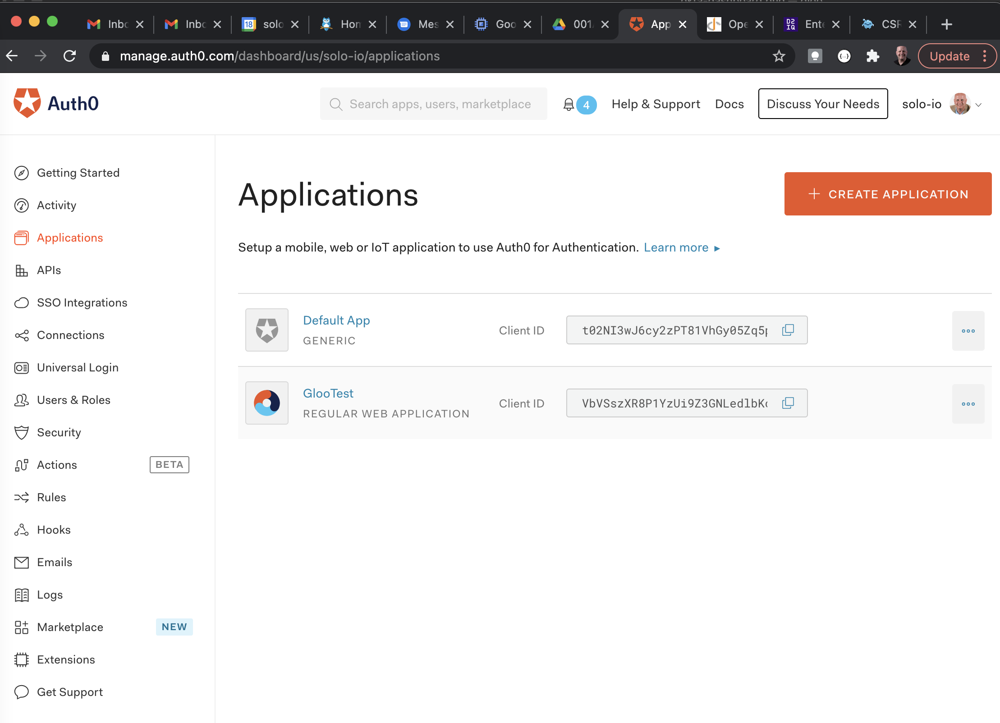

### Establish Auth0 Users

For new developer accounts, you need to establish one or more Auth0 users for testing.  The simplest quickstart approach for adding new users is via the console: https://manage.auth0.com/dashboard/us/solo-io/users.  As before, you will need to replace `solo-io` with your own Auth0 Tenant Domain.  

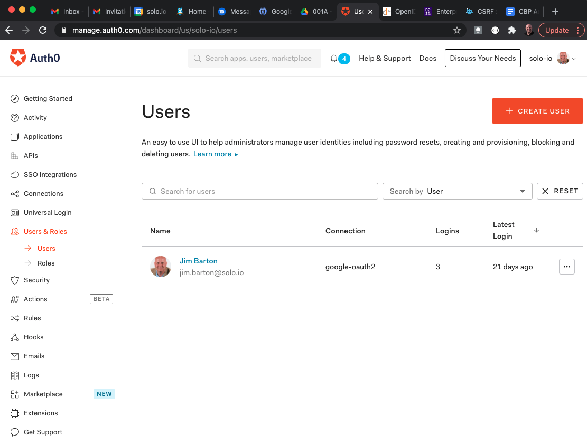

### Establish Auth0 Application

You will need to establish an Auth0 application to integrate with Gloo Edge.  In this guide we prioritized providing a quickstart for testing over production readiness.  In establishing the Auth0 application from the dashboard wizard, we defined this as a `Regular Web Application` type application and gave the application a name `GlooTest`.  Other possibilities we did not test were `Machine to Machine`, `Native`, and `Single Page Application`.

For the "What technology are you using for your project?" question, we chose `Apache`, although that choice had no noticeable impact on our Gloo Edge setup.

Beyond that, we changed only one of the default settings from the new-application wizard: `Allowed Callback URLs`, for which we provided a single value `https://glootest.com/callback`.  For more details on creating `Regular Web Application` integrations with Auth0, we found [this guide](https://auth0.com/docs/applications/set-up-an-application/register-regular-web-applications) helpful.

Our completed Auth0 `GlooTest` application profile looked like this.

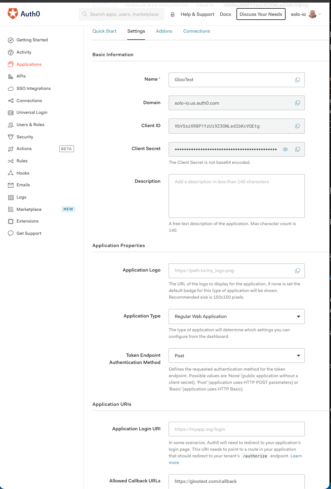

Finally, ensure from the Auth0 application's `Users` tab that at least some of your Auth0 users have been assigned to your new application.  Note that we have created a single user with a `google-oauth2` connection.

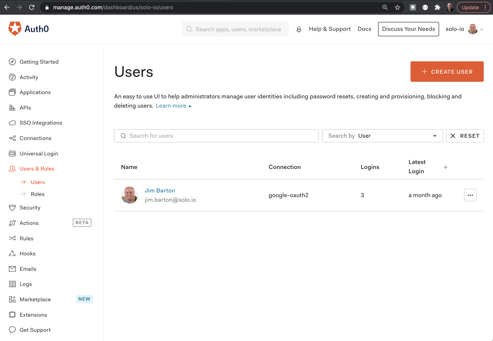

### Establish Gloo Edge AuthConfig for Auth0 App

In this section we will establish the OAuth secret and an AuthConfig resource to connect Gloo Edge with the OIDC provider.  Be sure to have your Auth0 client ID and client secret ready, available from the details page for your Auth0 application, under `Basic Information`.

Create the oauth secret in Kubernetes using `glooctl` with the Auth0 application secret.

```shell
% glooctl create secret oauth --namespace gloo-system --name auth0-client-secret --client-secret $CLIENT_SECRET
```
```shell
+---------------------+-------+
|       SECRET        | TYPE  |
+---------------------+-------+
| auth0-client-secret | OAuth |
+---------------------+-------+
```

Create a Gloo Edge AuthConfig object to finish connecting the gateway to the OIDC provider.  Use `kubectl` to apply this change.

```yaml
apiVersion: enterprise.gloo.solo.io/v1
kind: AuthConfig
metadata:
  name: auth0-ac
  namespace: gloo-system
spec:
  configs:
  - oauth2:
      oidcAuthorizationCode:
        appUrl: https://glootest.com
        callbackPath: /callback
        clientId: <insert-your-app-client-id-here>
        clientSecretRef:
          name: auth0-client-secret
          namespace: gloo-system
        issuerUrl: <insert-your-app-url-here>
        scopes:
        - email
```

Note that we have used the `scopes` parameter to indicate that the identity provider should include the `email` of the user in the claims of the JWT token it will return.

Finally, use `kubectl` to update the Virtual Service to use Auth0 OIDC authentication:


apiVersion: gateway.solo.io/v1
kind: VirtualService
metadata:
  name: httpbin-auth0-vs
  namespace: gloo-system
spec:
  sslConfig:
    secretRef:
      name: upstream-tls
      namespace: gloo-system
  virtualHost:
    domains:
    - 'glootest.com'
    routes:
    - matchers:
      - prefix: /
      routeAction:
        single:
          upstream:
            name: default-httpbin-8000
            namespace: gloo-system
    options:
      extauth:
        configRef:
          name: auth0-ac
          namespace: gloo-system


Note that the `/callback` path will be handled by this same Virtual Service because we used a catch-all `/` prefix matcher.

### Adjust the timeout
It is common for initial requests that are routed through Auth0, or any external security service provider, to fail due to an untuned `requestTimeout` parameter in the Gloo `Settings` object. The default timeout is 200ms, which is often inadequate to account for the external network hop to Auth0. Increasing that timeout can resolve the problem.

You can get the current state of the `Settings` object like this:
```shell
% kubectl get settings.gloo.solo.io -n gloo-system -oyaml
```

Then apply a change to the `spec.extauth` stanza of [settings]() to add a `requestTimeout` greater than 200ms, like this:

    extauth:
      requestTimeout: 1s
      extauthzServerRef:
        name: extauth
        namespace: gloo-system


### Verify Auth0 Integration


You may encounter issues in completing this section.  If so, check out the `Troubleshooting` section immediately following this one.


We will now confirm that the initial Auth0 integration using a web browser.  First, navigate to https://glootest.com.  You should be redirected to the Auth0 Login page.  

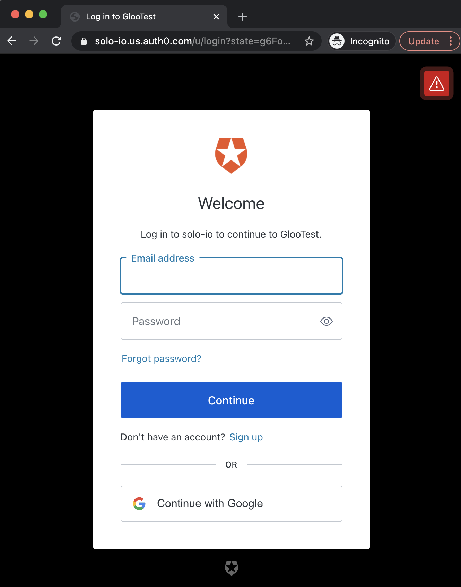

Sign in as one of your configured Auth0 users who is authorized for this application.  In our case, we will use the `Continue with Google` option to login as our `google-oauth2` user.

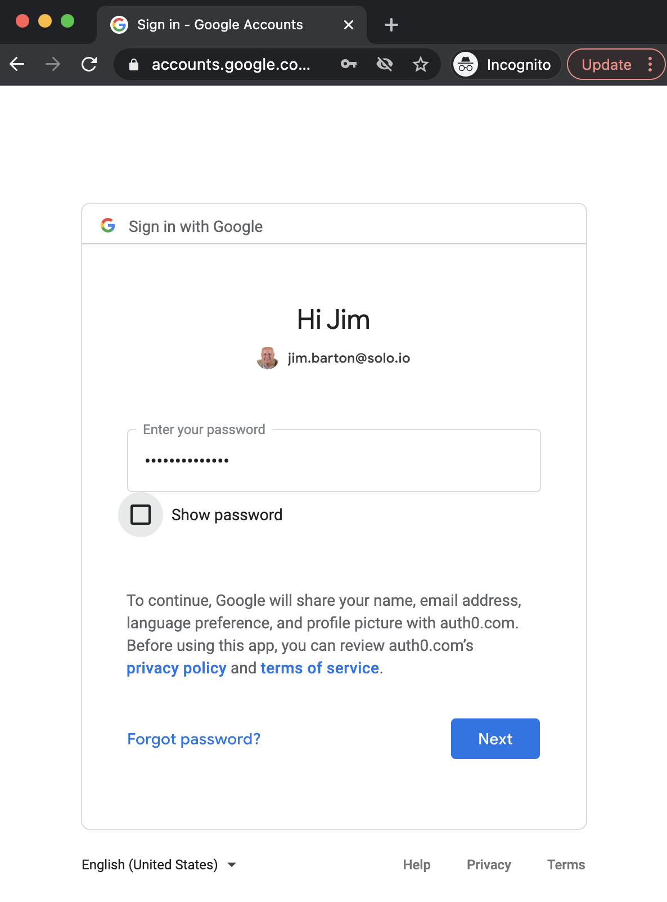

You should now be redirected to the `/callback` endpoint we configured in the AuthConfig, with the information it received from Auth0 OIDC added as a query string to create a Cookie.  This cookie contains both an `access_token` and an `id_token` from Auth0.  The `id_token` is a JWT from which we will extract claims to drive fine-grained RBAC decisions later in this exercise.  

After this callback, the normal request flow continues and the upstream `httpbin` application responds as expected.  You should get output that looks something like below.  In particular, note the `Cookie` header supplied by Auth0 containing both an `access_token` and an `id_token`.

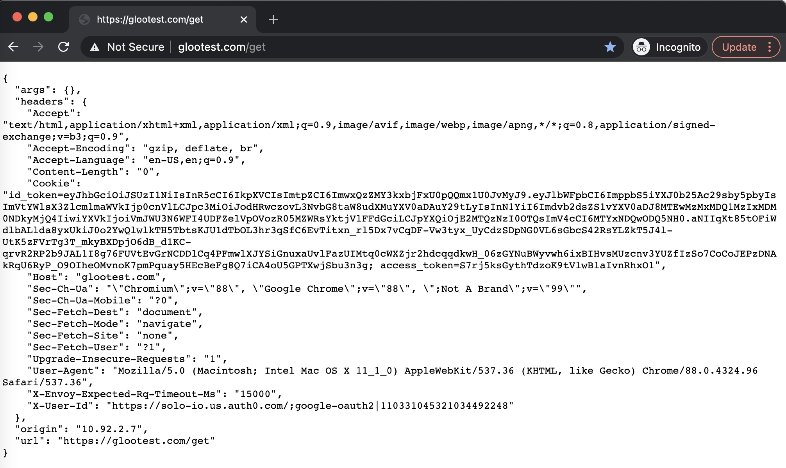

You can also test other `httpbin` endpoints via the Gloo Edge gateway.  For example, consider this base64 conversion service endpoint:  https://glootest.com/base64/R2xvbyBpcyBhd2Vzb21lCg==


### Troubleshooting Auth0 Integration

The examples in this guide were tested using both Safari and Chrome on MacOS.  You may experience some issues in development mode due to the use of self-signed certificates.  These present as 403 Forbidden errors, possibly with an `ERR_CERT_INVALID` error code.  With Safari, you can work through this by clicking through advanced settings and indicating you understand the risks.  With Chrome, you may need to use the `thisisunsafe` workaround described [here](https://medium.com/@dblazeski/chrome-bypass-net-err-cert-invalid-for-development-daefae43eb12).

You may experience browser issues if there is an overlap between the email of your Auth0 user and an active Google oauth connection in your browser.  Issuing these requests in Incognito (Chrome) or Private (Safari) windows resolves these problems.


## JWT Claim Extraction

The `id_token` contains a [JWT](https://jwt.io/) from which we can extract claims that may be useful in driving downstream RBAC policies.  In this section, we will enhance our Virtual Service by applying a transformation.  

### Transform Auth0 Cookie to JWT Header

It will use a regular expression to extract the JWT token from the Cookie header.  Then it will create a new `Jwt` header containing the token.  Finally, we will remove the cookie header from the request.

Apply these transformation changes to the Gloo Edge Virtual Service.


apiVersion: gateway.solo.io/v1
kind: VirtualService
metadata:
  name: httpbin-auth0-vs
  namespace: gloo-system
spec:
  sslConfig:
    secretRef:
      name: upstream-tls
      namespace: gloo-system
  virtualHost:
    domains:
    - 'glootest.com'
    routes:
    - matchers:
      - prefix: /
      routeAction:
        single:
          upstream:
            name: default-httpbin-8000
            namespace: gloo-system
    options:
      extauth:
        configRef:
          name: auth0-ac
          namespace: gloo-system
      stagedTransformations:
        early:
          requestTransforms:
          - requestTransformation:
              transformationTemplate:
                extractors:
                  token:
                    header: 'cookie'
                    regex: '.*id_token=([^;]*).*'
                    subgroup: 1
                headers:
                  jwt:
                    text: '{{ token }}'
      headerManipulation:
        requestHeadersToRemove:
        - "cookie"


Below is the type of output you should see when you refresh the web page.  Note that the `Cookie` header has been replaced by a `Jwt` header.

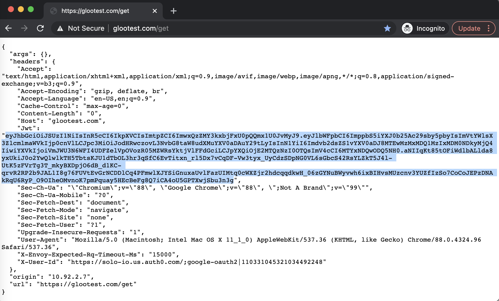

If we paste the contents of the `Jwt` header into the JWT decoder at jwt.io, we can see some of the JWT claims that are available for us to make routing and authorization decisions.  In particular, note the `email` claim that we specified in the AuthConfig resource.

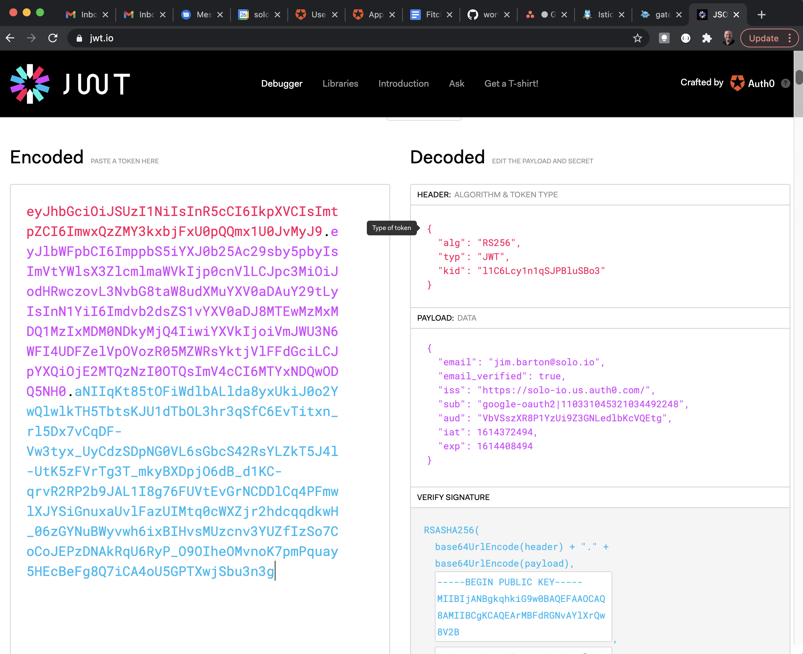

### Convert JWT to Request Header

In this section, we will use JWKS (JSON Web Key Set) to transform the JWT we extracted from the Auth0 callback into a specific `email` header that can drive fine-grained authorization decisions.  Auth0 publishes a read-only JWKS endpoint where public keys can be extracted that allow us to decode our JWT and then place its claims into request headers.  Details about how Auth0 publishes its JWKS keys is available [here](https://auth0.com/docs/tokens/json-web-tokens/json-web-key-sets).

First, we need to specify a Gloo Edge Upstream that exposes the JWKS endpoint that Auth0 publishes for our development account.  Use `kubectl` to apply this Upstream to our cluster.

```yaml
apiVersion: gloo.solo.io/v1
kind: Upstream
metadata:
  name: auth0-jwks-upstream
  namespace: gloo-system
spec:
  static:
    hosts:
      # This upstream identifies the host where Auth0 publishes the JWKS endpoint for my dev account
      # See https://solo-io.us.auth0.com/
      - addr: solo-io.us.auth0.com
        port: 443
```

Next, we will update our Virtual Service to use the JWKS upstream to decode the JWT and convert the `email` claim to a custom header `x-solo-claim-email`.  Apply these changes using `kubectl`.


apiVersion: gateway.solo.io/v1
kind: VirtualService
metadata:
  name: httpbin-auth0-vs
  namespace: gloo-system
spec:
  sslConfig:
    secretRef:
      name: upstream-tls
      namespace: gloo-system
  virtualHost:
    domains:
    - 'glootest.com'
    routes:
    - matchers:
      - prefix: /
      routeAction:
        single:
          upstream:
            name: default-httpbin-8000
            namespace: gloo-system
    options:
      extauth:
        configRef:
          name: auth0-ac
          namespace: gloo-system
      stagedTransformations:
        early:
          requestTransforms:
          - requestTransformation:
              transformationTemplate:
                extractors:
                  token:
                    header: 'cookie'
                    regex: '.*id_token=([^;]*).*'
                    subgroup: 1
                headers:
                  jwt:
                    text: '{{ token }}'
      headerManipulation:
        requestHeadersToRemove:
        - "cookie"
      jwt:
        providers:
          auth0:
            issuer: https://solo-io.us.auth0.com/
            tokenSource:
              headers:
              - header: Jwt
            claimsToHeaders:
            - claim: email
              header: x-solo-claim-email
            jwks:
              remote:
                url: https://solo-io.us.auth0.com/.well-known/jwks.json
                upstreamRef:
                  name: auth0-jwks-upstream
                  namespace: gloo-system


Refreshing the web page yields output like the following.  Note in particular that the `Jwt` header is removed and has been replaced by the `X-Solo-Claim-Email` header, whose contents match the `email` claim in the JWT from the Auth0 callback.

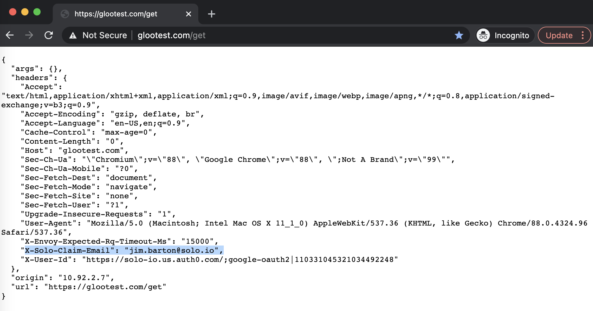

## Driving RBAC Decisions Using JWT Claims

In this section, we will use the `email` user identity extracted from the JWT to drive authorization decisions.  Let's apply it to a simple use case where we only want to allow the `jim.barton@solo.io` user to have access to the httpbin `/get` endpoint but no others.

Apply the following change to your cluster using `kubectl`.


apiVersion: gateway.solo.io/v1
kind: VirtualService
metadata:
  name: httpbin-auth0-vs
  namespace: gloo-system
spec:
  sslConfig:
    secretRef:
      name: upstream-tls
      namespace: gloo-system
  virtualHost:
    domains:
    - 'glootest.com'
    routes:
    - matchers:
      - prefix: /
      routeAction:
        single:
          upstream:
            name: default-httpbin-8000
            namespace: gloo-system
    options:
      extauth:
        configRef:
          name: auth0-ac
          namespace: gloo-system
      stagedTransformations:
        early:
          requestTransforms:
          - requestTransformation:
              transformationTemplate:
                extractors:
                  token:
                    header: 'cookie'
                    regex: '.*id_token=([^;]*).*'
                    subgroup: 1
                headers:
                  jwt:
                    text: '{{ token }}'
      headerManipulation:
        requestHeadersToRemove:
        - "cookie"
      jwt:
        providers:
          auth0:
            issuer: https://solo-io.us.auth0.com/
            tokenSource:
              headers:
              - header: Jwt
            claimsToHeaders:
            - claim: email
              header: x-solo-claim-email
            jwks:
              remote:
                url: https://solo-io.us.auth0.com/.well-known/jwks.json
                upstreamRef:
                  name: auth0-jwks-upstream
                  namespace: gloo-system
      rbac:
        policies:
          viewer:
            permissions:
              methods:
              - GET
              pathPrefix: /get
            principals:
            - jwtPrincipal:
                claims:
                  email: jim.barton@solo.io


If authenticated using the `email` in the `rbac` policy, the `https://glootest.com/get` endpoint will respond in the web browser exactly as before.  However, authenticating as a different user or exercising a different endpoint will result in an `access denied` error like this.


## Cache the JWT in Redis

Let's briefly review where we are.  The request flow that we have constructed so far does the following:
* responds to initial calls on the Gloo endpoint by forwarding the user to an Auth0 authentication dialog
* accepts a callback from Auth0 containing a JWT in a cookie header
* extracts and validates the token from the cookie
* extracts "interesting" claims from the JWT, like the end user's email address
* adds new request headers based on those claims
* applies RBAC rules to determine if the request should be authorized based on those headers

While this approach is functional, some users will raise concerns about its security and scalability.  From a security standpoint, many will balk at holding bearer token information in the web browser.  They prefer the actual token to be stored on the server side with a simple pointer to it managed by the browser.  In addition, for some users this approach doesn't scale well to production deployments because a JWT with many claims can exceed cookie size thresholds enforced by web browsers.

For these reasons, Gloo offers a facility that allows users to cache the actual token in the Gloo Edge Redis instance with only a handle stored in the browser.  Note that you are not restricted to using the bundled Redis; you can point this configuration at any valid instance.

To demonstrate JWT caching, we will expand our AuthConfig to use the bundled Redis to store our access token and simply hold a reference to it in a cookie named `auth0-session`.  Apply these changes to your cluster.


apiVersion: enterprise.gloo.solo.io/v1
kind: AuthConfig
metadata:
  name: auth0-ac
  namespace: gloo-system
spec:
  configs:
  - oauth2:
      oidcAuthorizationCode:
        appUrl: https://glootest.com
        callbackPath: /callback
        clientId: <insert-your-app-client-id-here>
        clientSecretRef:
          name: auth0-client-secret
          namespace: gloo-system
        issuerUrl: https://solo-io.us.auth0.com/
        scopes:
        - email
        session:
          failOnFetchFailure: true
          redis:
            cookieName: auth0-session
            options:
              host: redis.gloo-system.svc.cluster.local:6379


Then we will move back to a simpler Virtual Service that will enable us to see how Gloo manages our token.  Apply these changes to your cluster as well.

```yaml
apiVersion: gateway.solo.io/v1
kind: VirtualService
metadata:
  name: httpbin-auth0-vs
  namespace: gloo-system
spec:
  sslConfig:
    secretRef:
      name: upstream-tls
      namespace: gloo-system
  virtualHost:
    domains:
    - 'glootest.com'
    routes:
    - matchers:
      - prefix: /
      routeAction:
        single:
          upstream:
            name: default-httpbin-8000
            namespace: gloo-system
    options:
      extauth:
        configRef:
          name: auth0-ac
          namespace: gloo-system
```

Refresh your web browser and note that the cookie now contains an `auth0-session` header as shown below.  This session header is not the JWT itself, but a pointer to a Redis key that now securely holds the JWT.

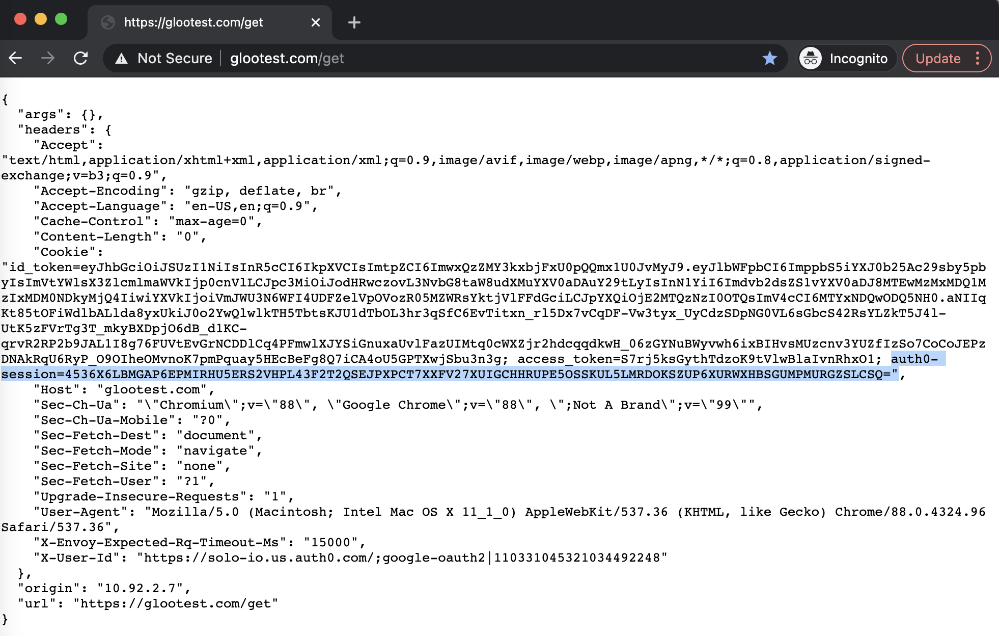

## Re-establish JWT header to drive RBAC decisions

Now we have secured our JWT in that our web browser no longer holds a cookie containing our security token.  However, in doing this we have lost the ability to drive RBAC decisions based on claims inside the JWT.  

We will restore that capability in this section by configuring Gloo to fetch the token from Redis into a request header, and then we will use that header to drive RBAC decisions as before.

First, we will extend our AuthConfig to have Gloo place the JWT in a request header.


apiVersion: enterprise.gloo.solo.io/v1
kind: AuthConfig
metadata:
  name: auth0-ac
  namespace: gloo-system
spec:
  configs:
  - oauth2:
      oidcAuthorizationCode:
        appUrl: https://glootest.com
        callbackPath: /callback
        clientId: <insert-your-app-client-id-here>
        clientSecretRef:
          name: auth0-client-secret
          namespace: gloo-system
        issuerUrl: https://solo-io.us.auth0.com/
        scopes:
        - email
        session:
          failOnFetchFailure: true
          redis:
            cookieName: auth0-session
            options:
              host: redis.gloo-system.svc.cluster.local:6379
        headers:
          idTokenHeader: "jwt"


After applying that AuthConfig change, note that the `Jwt` header re-appears in the list of headers returned from `httpbin`.


Now we can restore our Virtual Service's RBAC policies from the end of the previous session and confirm that they still work as before.  But now we are doing in a more secure way that does not risk exceeding cookie size thresholds in the web browser.

```yaml
apiVersion: gateway.solo.io/v1
kind: VirtualService
metadata:
  name: httpbin-auth0-vs
  namespace: gloo-system
spec:
  sslConfig:
    secretRef:
      name: upstream-tls
      namespace: gloo-system
  virtualHost:
    domains:
    - 'glootest.com'
    routes:
    - matchers:
      - prefix: /
      routeAction:
        single:
          upstream:
            name: default-httpbin-8000
            namespace: gloo-system
    options:
      extauth:
        configRef:
          name: auth0-ac
          namespace: gloo-system
      headerManipulation:
        requestHeadersToRemove:
        - "cookie"
      jwt:
        providers:
          auth0:
            issuer: https://solo-io.us.auth0.com/
            tokenSource:
              headers:
              - header: Jwt
            claimsToHeaders:
            - claim: email
              header: x-solo-claim-email
            jwks:
              remote:
                url: https://solo-io.us.auth0.com/.well-known/jwks.json
                upstreamRef:
                  name: auth0-jwks-upstream
                  namespace: gloo-system
      rbac:
        policies:
          viewer:
            permissions:
              methods:
              - GET
              pathPrefix: /get
            principals:
            - jwtPrincipal:
                claims:
                  email: jim.barton@solo.io
```

Now when you refresh the browser, you should see just the `X-Solo-Claim-Email` header, which was used by Gloo to authorize the request.  Try a different endpoint, such as `https://glootest.com/base64/R2xvbyBpcyBhd2Vzb21lCg==`, and you will see the `RBAC: access denied` message.


## Enable Logout Redirect to Remove Session Cookie

One final configuration option to consider is enabling Gloo to trigger removal of the Redis session token when the user's application session ends.  This is accomplished by configuring the `Allowed Logout URLs` option on the Auth0 application to point to a URL that the Gloo AuthConfig is expecting.  You specify this in the AuthConfig by providing a `logoutPath:` URI.  One possibility is shown below.


apiVersion: enterprise.gloo.solo.io/v1
kind: AuthConfig
metadata:
  name: auth0-ac
  namespace: gloo-system
spec:
  configs:
  - oauth2:
      oidcAuthorizationCode:
        appUrl: https://glootest.com
        callbackPath: /callback
        clientId: <insert-your-app-client-id-here>
        clientSecretRef:
          name: auth0-client-secret
          namespace: gloo-system
        issuerUrl: https://solo-io.us.auth0.com/
        scopes:
        - email
        session:
          failOnFetchFailure: true
          redis:
            cookieName: auth0-session
            options:
              host: redis.gloo-system.svc.cluster.local:6379
        headers:
          idTokenHeader: "jwt"
        logoutPath: /logout
