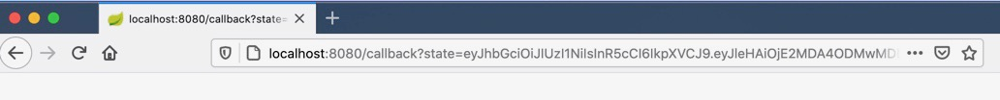

In this guide we will see how to authenticate users with your application by allowing them to log in to their Google 
account. This guide is just an example to get you started and does not cover all aspects of a complete setup, 
like setting up a domain and SSL certificates.

## Setup
{}
This feature requires Gloo Edge's external auth server to communicate with an external OIDC provider/authorization server.
Because of this interaction, the OIDC flow may take longer than the default timeout of 200ms.
You can increase this timeout by setting the {}.
The external auth settings can be configured on the {}.
{}



### Deploy sample application
{}
The sample `petclinic` application deploys a MySql server. If you are using `minikube` v1.5 to run this guide, this 
service is likely to crash due a `minikube` [issue](https://github.com/kubernetes/minikube/issues/5751). 
To get around this, you can start `minikube` with the following flag:

```shell
minikube start --docker-opt="default-ulimit=nofile=102400:102400" 
```
{}

Let's deploy a sample web application that we will use to demonstrate these features:
```shell
kubectl apply -f https://raw.githubusercontent.com/solo-io/gloo/v1.14.x/example/petstore/petstore.yaml
```

### Creating a Virtual Service
Now we can create a Virtual Service that routes all requests (note the `/all-pets` prefix) to the `petstore` service.

```yaml
apiVersion: gateway.solo.io/v1
kind: VirtualService
metadata:
  name: default
  namespace: gloo-system
spec:
  virtualHost:
    domains:
    - '*'
    routes:
    - matchers:
      - exact: /all-pets
      options:
        prefixRewrite: /api/pets
      routeAction:
        single:
          upstream:
            name: default-petstore-8080
            namespace: gloo-system
```

To verify that the Virtual Service has been accepted by Gloo Edge, let's port-forward the Gateway Proxy service so that it is 
reachable from you machine at `localhost:8080`:
```
kubectl -n gloo-system port-forward svc/gateway-proxy 8080:80
```

If you open your browser and navigate to [http://localhost:8080/all-pets](http://localhost:8080/all-pets) you should
see the following text (you might need to wait a minute for the containers to start):

```
[{"id":1,"name":"Dog","status":"available"},{"id":2,"name":"Cat","status":"pending"}]
```

## Securing the Virtual Service
As we just saw, we were able to reach our application without having to provide any credentials. This is because by default Gloo Edge allows any request on routes that do not specify authentication configuration. Let's change this behavior. We will update the Virtual Service so that each request to the sample application is authenticated using an **OpenID Connect** flow.

### Register your application with Google
In order to use Google as our identity provider, we need to register our application with the Google API.
To do so:
 
- Log in to the [Google Developer Console](https://console.developers.google.com/)
- If this is the first time using the console, create a [project](https://cloud.google.com/resource-manager/docs/creating-managing-projects)
as prompted;
- Navigate to the [OAuth consent screen](https://console.developers.google.com/apis/credentials/consent) menu item
- Input a name for your application in the *Application name* text field and select **Internal** as the *Application type*
- Click **Save**;
- Navigate to the [Credentials](https://console.developers.google.com/apis/credentials) menu item
- click **Create credentials**, and then **OAuth client ID**
- On the next page, select *Web Application* as the type of the client (as we are only going to use it for demonstration purposes), 
- Enter a name for the OAuth client ID or accept the default value
- Under *Authorized redirect URIs* click on **Add URI**
- Enter the URI: `http://localhost:8080/callback`
- Click **Create**

You will be presented with the **client id** and **client secret** for your application.
Let's store them in two environment variables:

```noop
CLIENT_ID=<your client id>
CLIENT_SECRET=<your client secret>
```

### Create a client ID secret
Gloo Edge expects the client secret to stored in a Kubernetes secret. Let's create the secret with the value of our `CLIENT_SECRET` variable:

```shell
glooctl create secret oauth --namespace gloo-system --name google --client-secret $CLIENT_SECRET
```

### Create an AuthConfig
{}
{}
{}

Now let's create the `AuthConfig` resource that we will use to secure our Virtual Service.

```shell
kubectl apply -f - <<EOF
apiVersion: enterprise.gloo.solo.io/v1
kind: AuthConfig
metadata:
  name: google-oidc
  namespace: gloo-system
spec:
  configs:
  - oauth2:
      oidcAuthorizationCode:
        appUrl: http://localhost:8080
        callbackPath: /callback
        clientId: $CLIENT_ID
        clientSecretRef:
          name: google
          namespace: gloo-system
        issuerUrl: https://accounts.google.com
        session:
          cookieOptions:
            notSecure: true
        scopes:
        - email
EOF
```

{}
The above configuration uses the new `oauth2` syntax. The older `oauth` syntax is still supported, but has been deprecated.
Note this example explicitly allows insecure cookies (`session.cookieOptions.notSecure`), so that it works in this guide using localhost. In a live hosted environment secured with TLS, you should not set this.
{}

Notice how we set the `CLIENT_ID` and reference the client secret we just created. The `callback_path` matches the authorized redirect URI we added for the OAuth Client ID. Redirecting to an unauthorized URI would result in an error from the Google authentication flow.

### Update the Virtual Service
Once the AuthConfig has been created, we can use it to secure our Virtual Service:


apiVersion: gateway.solo.io/v1
kind: VirtualService
metadata:
  name: default
  namespace: gloo-system
spec:
  virtualHost:
    domains:
    - '*'
    routes:
    - matchers:
      - prefix: /callback
      options:
        prefixRewrite: '/login'
      routeAction:
        single:
          upstream:
            name: default-petstore-8080
            namespace: gloo-system
    - matchers:
      - exact: /all-pets
      options:
        prefixRewrite: /api/pets
      routeAction:
        single:
          upstream:
            name: default-petstore-8080
            namespace: gloo-system
    options:
      extauth:
        configRef:
          name: google-oidc
          namespace: gloo-system


{}
This example is sending the `/callback` prefix to `/login`, a path that does not exist. The request will not be interpreted by the petstore service, but you could easily add code for the `/login` path that would parse the state information from Google and use it to load a profile of the user.
{}

## Testing our configuration
Since we didn't register an external URL, Google will only allow authentication with applications running on localhost for security reasons. We can make the Gloo Edge proxy available on localhost using `kubectl port-forward`:

```shell
kubectl port-forward -n gloo-system deploy/gateway-proxy 8080 &
portForwardPid=$! # Store the port-forward pid so we can kill the process later
```

Now if you open your browser and go to [http://localhost:8080/all-pets](http://localhost:8080/all-pets) you should be redirected to the Google login screen:


 
If you provide your Google credentials, Gloo Edge should redirect you to the `/callback` page, with the information from Google added as a query string.



If this does not work, one thing to check is the `requestTimeout` setting on your `extauth` Settings. See the warning in the [setup section](#setup) for more details.

### Logging

If Gloo Edge is running on kubernetes, the extauth server logs can be viewed with:
```
kubectl logs -n gloo-system deploy/extauth -f
```
If the auth config has been received successfully, you should see the log line:
```
"logger":"extauth","caller":"runner/run.go:179","msg":"got new config"
```

## Cleanup
To clean up the resources we created during this tutorial you can run the following commands:

```bash
kill $portForwardPid
kubectl delete virtualservice -n gloo-system default
kubectl delete authconfig -n gloo-system google-oidc
kubectl delete secret -n gloo-system google
kubectl delete -f https://raw.githubusercontent.com/solo-io/gloo/v1.14.x/example/petstore/petstore.yaml
```