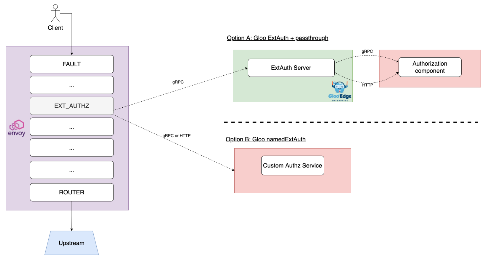

Gloo Edge Enterprise comes with an External Authorization service, with full-featured security policies, like OpenID Connect, Open Policy Agent, OAuth 2 scopes and a few more. Also, using the so-called **passthrough** system, you can extend the authorization logic and call your own authentication or authorization service.

There are certain cases where it's more relevant to directly plug the `ext_authz` Envoy filter to your own authorization service. This article describes how to configure such connections between the Envoy data-plane and third-party authorization services.

## Calling an external authorization service

Say you are running a corporate access management service that is in charge of returning new claims, like the `role` of the user who is authenticated.
With Gloo Edge Enterprise, you can call the external service in two, non-exclusive ways, as shown in the following figure.
- Option A: use the **Passthrough Auth** [plug-in](), which comes with all the ExtAuth options (see `AuthConfig > passthrough`)
- Option B: define an additional ExtAuth server with the `namedExtAuth` setting, and call the additional ExtAuth server on the routes of your choice

In the first option, the connection has an extra network hop, but you can use the `AuthConfig` CR and more easily pass information between the authentication and authorization steps. For more information, see the [gRPC Passthrough Auth guide]({}).

### Option A - Using the passthrough system

With Option A, you can compose your authentication and authorization workflow with the `AuthConfig` Custom Resource.
For instance, you can have a block that leverages the built-in OpenID Connect plug-in and another block where you define how to call your external authorization service. 

The following diagram depicts a common use case wherein Gloo:
- uses OIDC to authenticate the end user
- uses the passthrough system to populate the request with an additional JWT, having authorization-centered claims (roles, etc.)
- uses the JWT policy to verify the signature of the newly created JWT

<figure>
<figcaption style="text-align:center;font-style:italic">Figure: Configure your authentication and authorization security workflow</figcaption></figure>

Also, note you can pass values between the `AuthConfig` blocks using the `State` map. More info in this [section]({}).

You can use either the [gRPC Passthrough Auth]({}) protocol or [HTTP Passthrough Auth]({}).

### Option B - Using namedExtAuth

In Gloo Edge Enterprise, you can define additional ExtAuthZ servers in the Gloo Edge settings.
For that, you must register your authorization servers in the "default" `Settings` custom resource, as shown in the following example. For more information, see the [API reference](https://docs.solo.io/gloo-edge/latest/reference/api/github.com/solo-io/gloo/projects/gloo/api/v1/settings.proto.sk/#settings).


kubectl -n gloo-system patch st/default --type merge -p "
spec:
  extauth:
    extauthzServerRef:
      name: extauth
      namespace: gloo-system
    transportApiVersion: V3
    userIdHeader: x-user-id
  namedExtauth:
    customHttpAuthz: # custom name
      extauthzServerRef: # define where is running the third-party authorization server
        name: default-http-echo-8080 # this is an Upstream CR. You must create it.
        namespace: gloo-system
      httpService: # this option enables communication over HTTP instead of gRPC (which is the default)
        pathPrefix: /
"


A more advanced use case is shown in the schema below. There are two additional ExtAuth services added to Gloo's configuration.

<figure>
<figcaption style="text-align:center;font-style:italic">NamedExtAuth - click and zoom in to see the details</figcaption></figure>

Gloo users can decide which ExtAuth service they want to call on a per-route level, using `customAuth`.
Example:


apiVersion: gateway.solo.io/v1
kind: VirtualService
metadata:
  name: httpbin
  namespace: gloo-system
spec:
  virtualHost:
    domains:
    - '*'
    routes:
    - matchers:
      - prefix: /
      routeAction:
        single:
          upstream:
            name: default-httpbin-8000
            namespace: gloo-system
      options:
        extauth:
          customAuth: # set the authorization system at the route level
            name: customHttpAuthz # one of the `namedExtAuth` 


## The gRPC specification

For both the **Passthrough Auth** option and the **namedExtAuth** option, you must conform to the Envoy specification for the external Authorization service. For more information, see the following resources.

* [Envoy external auth proto](https://github.com/envoyproxy/envoy/blob/main/api/envoy/service/auth/v3/external_auth.proto)
* [gRPC Passthrough Auth guide]({})
* [GitHub repo with Go examples](https://github.com/solo-io/gloo/tree/main/docs/examples/grpc-passthrough-auth/pkg/auth/v3)

## Managing headers

You can add new headers to the request from your external authorization service.

### gRPC mode

For gRPC, use the [protobuf specification](https://github.com/envoyproxy/envoy/blob/main/api/envoy/service/auth/v3/external_auth.proto#L76) and [populate the `OkHttpResponse`]({}) with the new headers. The new headers are visible to the rest of the filter chain and are passed to the upstream service. For more information, see [Sharing state with other auth steps]({}).

### HTTP mode

With both the **HTTP passthrough** option and the **namedExtAuth** with HTTP option, if you want to send new headers to the rest of the filter chain or to the upstream service, then just add the headers to the authorization response. Then, the headers are merged into the original request before being forwarded upstream.

You also decide which headers are allowed to go upstream and which are not. Under the `httpService` option, you can [define]({}) some rules about headers you want to forward to the external authorization service, and also rules to sanitize headers before forwarding the request upstream.

