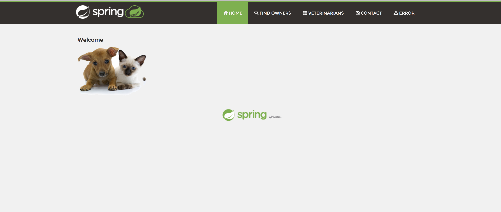

In this guide we will see how to authenticate users with your application by allowing them to log in to their Google 
account. This guide is just an example to get you started and does not cover all aspects of a complete setup, 
like setting up a domain and SSL certificates.

## Setup


### Deploy sample application
{}
The sample `petclinic` application deploys a MySql server. If you are using `minikube` v1.5 to run this guide, this 
service is likely to crash due a `minikube` [issue](https://github.com/kubernetes/minikube/issues/5751). 
To get around this, you can start `minikube` with the following flag:

```shell
minikube start --docker-opt="default-ulimit=nofile=102400:102400" 
```
{}

Let's deploy a sample web application that we will use to demonstrate these features:
```shell
kubectl apply -f https://raw.githubusercontent.com/solo-io/gloo/v0.8.4/example/petclinic/petclinic.yaml
```

### Creating a Virtual Service
Now we can create a Virtual Service that routes all requests (note the `/` prefix) to the `petclinic` service.

```yaml
apiVersion: gateway.solo.io/v1
kind: VirtualService
metadata:
  name: petclinic
  namespace: gloo-system
spec:
  virtualHost:
    domains:
    - '*'
    routes:
    - matchers:
      - prefix: /
      routeAction:
        single:
          kube:
            ref:
              name: petclinic
              namespace: default
            port: 80
```

To verify that the Virtual Service has been accepted by Gloo, let's port-forward the Gateway Proxy service so that it is 
reachable from you machine at `localhost:8080`:
```
kubectl -n gloo-system port-forward svc/gateway-proxy 8080:80
```

If you open your browser and navigate to [http://localhost:8080](http://localhost:8080) you should see the following page (you might need to wait a 
minute for the containers to start):



## Securing the Virtual Service
As we just saw, we were able to reach our application without having to provide any credentials. This is because by 
default Gloo allows any request on routes that do not specify authentication configuration. Let's change this behavior. 
We will update the Virtual Service so that each request to the sample application is authenticated using an 
**OpenID Connect** flow.

### Register your application with Google
In order to use Google as our identity provider, we need to register our application with the Google API.
To do so:
 
- log in to the [Google Developer Console](https://console.developers.google.com/);
- if this is the first time using the console, create a [project](https://cloud.google.com/resource-manager/docs/creating-managing-projects)
as prompted;
- navigate to the [OAuth consent screen](https://console.developers.google.com/apis/credentials/consent) menu item;
- input a name for your application in the **Application name** text field;
- click `Save`;
- navigate to the [Credentials](https://console.developers.google.com/apis/credentials) menu item;
- click `Create credentials`, and then `OAuth client ID`;
- on the next page, select `Other` as the type of the client (as we are only going to use it for demonstration purposes), 
- choose a name and click `Create`.

You will be presented with the **client id** and **client secret** for your application.
Let's store them in two environment variables:

```noop
CLIENT_ID=<your client id>
CLIENT_SECRET=<your client secret>
```

### Create a client ID secret
Gloo expects the client secret to stored in a Kubernetes secret. Let's create the secret with the value of our 
`CLIENT_SECRET` variable:

```shell
glooctl create secret oauth --namespace gloo-system --name google --client-secret $CLIENT_SECRET
```

### Create an AuthConfig
{}
{}
{}

Now let's create the `AuthConfig` resource that we will use to secure our Virtual Service.


kubectl apply -f - <<EOF
apiVersion: enterprise.gloo.solo.io/v1
kind: AuthConfig
metadata:
  name: google-oidc
  namespace: gloo-system
spec:
  configs:
  - oauth:
      app_url: http://localhost:8080
      callback_path: /callback
      client_id: $CLIENT_ID
      client_secret_ref:
        name: google
        namespace: gloo-system
      issuer_url: https://accounts.google.com
EOF


Notice how we set the `CLIENT_ID` and reference the client secret we just created.

### Update the Virtual Service
Once the AuthConfig has been created, we can use it to secure our Virtual Service:


apiVersion: gateway.solo.io/v1
kind: VirtualService
metadata:
  name: petclinic
  namespace: gloo-system
spec:
  virtualHost:
    domains:
    - '*'
    routes:
    - matchers:
      - prefix: /
      routeAction:
        single:
          kube:
            ref:
              name: petclinic
              namespace: default
            port: 80
    options:
      extauth:
        config_ref:
          name: google-oidc
          namespace: gloo-system


## Testing our configuration
Since we didn't register any URL, Google will only allow authentication with applications running on localhost for 
security reasons. We can make the Gloo Gateway available on localhost using `kubectl port-forward`:

```shell
kubectl port-forward -n gloo-system deploy/gateway-proxy 8080 &
portForwardPid=$! # Store the port-forward pid so we can kill the process later
```

Now if you open your browser and go to http://localhost:8080 you should be redirected to the Google login screen:


 
If you provide your Google credentials, Gloo should redirect you to the main page of our sample application!


## Cleanup
To clean up the resources we created during this tutorial you can run the following commands:

```bash
kill $portForwardPid
kubectl delete virtualservice -n gloo-system petclinic
kubectl delete authconfig -n gloo-system google-oidc
kubectl delete secret -n gloo-system google
kubectl delete -f https://raw.githubusercontent.com/solo-io/gloo/v0.8.4/example/petclinic/petclinic.yaml
```