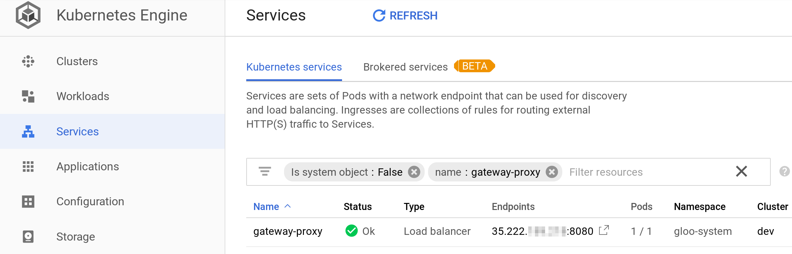

# Google Kubernetes Engine (GKE)
In this document we will review how to install Gloo on Google Kubernetes Engine.

# Configure kubectl

Configure kubectl to use with your cluster:

```
gcloud container clusters get-credentials CLUSTER-NAME --zone ZONE --project PROJECRT_ID
```

Validate that kubectl was successfully configured with:
```
kubectl cluster-info
```

# Install Gloo

Use kubectl to install gloo using it's released kubernetes manifest:
```
kubectl apply -f https://github.com/solo-io/gloo/releases/download/v0.6.19/gloo-gateway.yaml
```

In this example we are installing version 0.6.19. You can install any other released version.

The installation takes a few minutes to fully complete.

# Access from the Internet

Accessing your Gloo virtual services from the internet is easy with Google Kubernetes Engine.

Requests for Gloo's virtual services are routed via the `gateway-proxy` service. As the service type is *LoadBalancer*, Google will allocate a global IP address for it, and load balance requests on that IP address across the instances of the service.

To find the address of your Gloo, go to the *Services* tab of your GKE, add `name: gateway-proxy` to the search filters. The allocated address will be under the *Endpoints* column. 

For Example:



*NOTE:* You might not see see the address in the endpoint column immediately, as provisioning the cloud load balancer can take around 10 minutes. Try waiting a few minutes, and clicking the REFRESH link on the top of the page. 

You can now use the endpoints as your public address for requests.

# Final Notes

In addition to Gloo, usually you will also want to:

- Use a tool like *[external-dns](https://github.com/kubernetes-incubator/external-dns)* To setup DNS Record for Gloo.
- Use a tool like *[cert-manager](https://github.com/jetstack/cert-manager/)* to provision SSL certificates to use with Gloo's VirtualService CRD.
