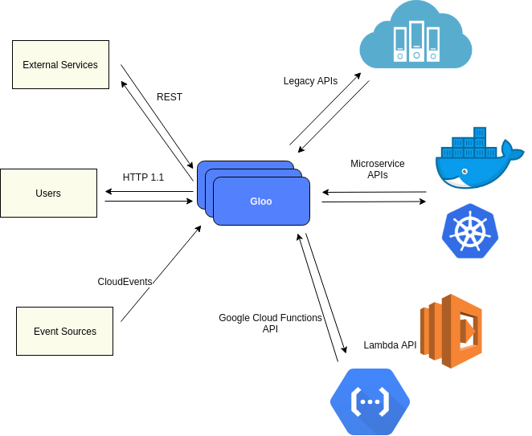
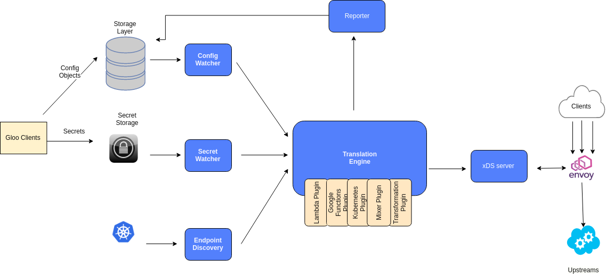
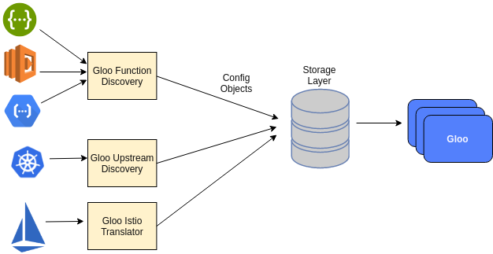

# Architecture

- [Overview](#Overview)
- [Component Architecture](#Component Architecture)
- [Discovery Architecture](#Discovery Architecture)

### Overview

Gloo aggregates back end services and provides function-to-function translation for clients, allowing decoupling from back end APIs

Clients issue requests or [emit events](https://github.com/solo-io/gloo-sdk-go) to routes defined on Gloo. These routes are mapped
to functions on upstream services by Gloo's configuration (provided by clients of Gloo's API). 

Gloo performs the necessary transformation between the routes defined by clients and the back end functions. Gloo is able 
to support various upstream functions through its extendable [function plugin interface](https://github.com/solo-io/gloo/blob/master/pkg/plugin/interface.go).

Gloo offers first-class API management features on all functions:

- Timeouts
- Metrics & Tracing
- Health Checks
- Retries
- Advanced load balancing
- TLS Termination with SNI Support
- HTTP Header modification
<!-- TODO: -Authentication -->
<!-- TODO: -JWT/Oauth2 -->

### Component Architecture

In the most basic sense, Gloo is a translation engine and [Envoy xDS server](https://github.com/envoyproxy/data-plane-api/blob/master/XDS_PROTOCOL.md)
 providing advanced configuration for Envoy (including Gloo's custom Envoy filters<!--(TODO)-->). Gloo follows an event-based architecture, watching various sources of configuration for
updates and responding immediately with v2 gRPC updates to Envoy. 

* The **Config Watcher** watches the storage layer for updates to user configuration objects ([Upstreams](concepts.md#Upstreams) and [Virtual Services](concepts.md#Virtual Services))
* The **Secret Watcher** watches a secret store for updates to secrets (which are required for certain plugins such as the [AWS Lambda Plugin](../plugins/aws.md))
* **Endpoint Discovery** watches service registries such as Kubernetes, Cloud Foundry, and Consul for IPs associated with services. 
Endpoint Discovery is plugin-specific. For example, the Kubernetes Plugin<!--(TODO)--> runs its own Endpoint Discovery goroutine.
* The **Translator** receives notifications from the 3 different classes of watchers and initiates a new *translation cycle*,
creating a new Envoy xDS Snapshot.
    1. The translation cycle starts by creating **[Envoy clusters](https://www.envoyproxy.io/docs/envoy/latest/api-v1/cluster_manager/cluster.html?highlight=cluster)** f
    rom all configured upstreams. Each upstream has a **type**,
    indicating which upstream plugin<!--(TODO)--> is responsible for processing that upstream object. Correctly configured upstreams are 
    converted into Envoy clusters by their respective plugins. Plugins may set cluster metadata on the cluster object.
    1. The next step in the translation cycle is to process all the functions on each upstream. Functional plugins<!--(TODO)--> process
    the functions on upstream, setting function-specifc cluster metadata, which will be later processed by function-specific Envoy
    filters.
    1. The next step generates all of the **[Envoy routes](https://www.envoyproxy.io/docs/envoy/latest/api-v2/api/v2/route/route.proto.html?highlight=route)** 
    via the route plugins<!--(TODO)-->. Routes are generated for 
    each route rule defined on the [virtual service objects](../v1/virtualservice.md). When all of the routes are created, the translator aggregates them
    into [Envoy virtual services](https://www.envoyproxy.io/docs/envoy/latest/api-v1/route_config/vService.html?highlight=virtual%20host)
    and adds them to a new [Envoy HTTP Connection Manager](https://www.envoyproxy.io/docs/envoy/latest/api-v1/route_config/vService.html?highlight=virtual%20host)
    configuration.
    1. Filter plugins<!--(TODO)--> are queried for their filter configurations, generating the list of HTTP Filters that will go 
    on the [Envoy listeners](https://www.envoyproxy.io/docs/envoy/latest/api-v1/listeners/listeners).
    1. Finally, a snapshot is composed of the all the valid endpoints, clusters, rds configs, and listeners
* The **Reporter** receives a validation report for every upstream and virtual service processed by the translator. Any invalid
  config objects are reported back to the user through the storage layer. Invalid objects are marked as "Rejected" with 
  detailed error messages describing mistakes in the user config.
* The final snapshot is passed to the **xDS server**, which notifies Envoy of a succesful config update, updating the Envoy
cluster with a new configuration to match the desired state set by Gloo.   

### Discovery Architecture

Gloo is supported by a suite of optional discovery services<!--(TODO)--> that automatically discover and configure 
gloo with upstreams and functions to simplify routing for users and self-service.  

Discovery services act as automated Gloo clients, automatically populating the storage layer with upstreams and functions
to facilitate easy routing for users.

Discovery is optional, but when enabled, will attempt to discover available upsrteams and functions.

Currently supported:

- Kubernetes Service-Based Upstream Discovery
- AWS Lambda-Based Function Discovery
- Google Cloud Function-Based Function Discovery
- OpenAPI-Based Function Discovery
- Istio-Based Route Rule Discovery (Experimental)

