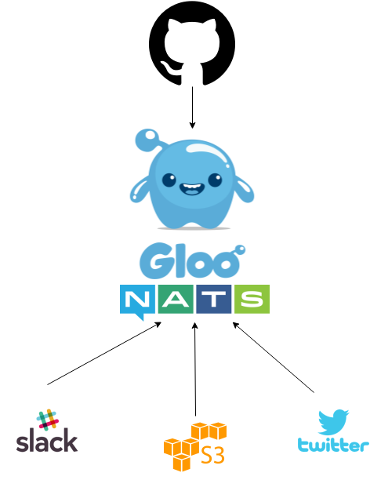

Sourcing Events from GitHub Webhooks
==========

<h3 align="center">
   
</h3>

## Setup

#### Deploy Gloo
    kubectl apply -f https://raw.githubusercontent.com/solo-io/gloo/master/install/kube/install.yaml

#### Deploy NATS and minio
    kubectl apply -f \
     https://raw.githubusercontent.com/solo-io/gloo/master/example/source_events_from_github/kube-deploy.yaml

#### Create a route for nats
    glooctl route create --sort \
        --path-exact /github-webhooks \
        --upstream default-nats-streaming-4222 \
        --function github-webhooks

#### Create a route for mirroring with minio
    glooctl route create --sort \
        --path-prefix=/ \
        --header "User-Agent:Minio.*" \
        --upstream default-minio-service-9000

## Image Pusher Microservice

#### Install minio client - linux
    wget https://dl.minio.io/client/mc/release/linux-amd64/mc
    chmod +x mc
    sudo mv mc /usr/local/bin/
#### Install minio client - mac
    brew install minio/stable/mc

#### Configure minio to point at gloo
    mc config host add gloo http://idit.aws.solo.io:8080 \
        gloo.solo.io \
        gloo.solo.io

#### deploy the image-pusher service
    kubectl apply -f  \
        https://raw.githubusercontent.com/solo-io/gloo/master/example/source_events_from_github/image-pusher/deploy.yaml

#### start mirroring the "images" minio bucket
    mkdir -p images
    mc mirror gloo/bucket ./images -w
        
browse to ./images in your file browser 

**unstar/star the git repo to see images appear**

## Star-Tweeter Microservice

#### create a kubernetes secret with your twitter credentials
    export TWITTER_CONSUMER_KEY=<your-twitter-consumer-key>
    export TWITTER_CONSUMER_SECRET=<your-twitter-consumer-secret>
    export TWITTER_ACCESS_TOKEN=<your-twitter-access-token>
    export TWITTER_ACCESS_SECRET=<your-twitter-access-secret>
    
    kubectl create secret -n default generic \
        twitter-secret \
        --from-literal=TWITTER_CONSUMER_KEY=${TWITTER_CONSUMER_KEY} \
        --from-literal=TWITTER_CONSUMER_SECRET=${TWITTER_CONSUMER_SECRET} \
        --from-literal=TWITTER_ACCESS_TOKEN=${TWITTER_ACCESS_TOKEN} \
        --from-literal=TWITTER_ACCESS_SECRET=${TWITTER_ACCESS_SECRET} 
    

#### deploy the microservice
    kubectl apply -f  \
        https://raw.githubusercontent.com/solo-io/gloo/master/example/source_events_from_github/star-tweeter/deploy.yaml

**unstar/star the git repo to see tweets appear**

## Slack-Bot Microservice

#### create a kubernetes secret with slack bot credentials
    export SLACK_TOKEN=<your-slack-api-token>
    
    kubectl create secret -n default generic slack-secret \
        --from-literal=SLACK_TOKEN=${SLACK_TOKEN}
    

#### deploy the microservice
    kubectl apply -f  \
        https://raw.githubusercontent.com/solo-io/gloo/master/example/source_events_from_github/slack-bot/deploy.yaml

**unstar/star the git repo to see slack messages**

#### Cleanup
    kubectl delete virtualservice default
    kubectl delete -f https://raw.githubusercontent.com/solo-io/gloo/master/example/source_events_from_github/kube-deploy.yaml 
    kubectl delete -f https://raw.githubusercontent.com/solo-io/gloo/master/example/source_events_from_github/image-pusher/deploy.yaml 
    kubectl delete -f https://raw.githubusercontent.com/solo-io/gloo/master/example/source_events_from_github/slack-bot/deploy.yaml 
    kubectl delete -f https://raw.githubusercontent.com/solo-io/gloo/master/example/source_events_from_github/star-tweeter/deploy.yaml 
