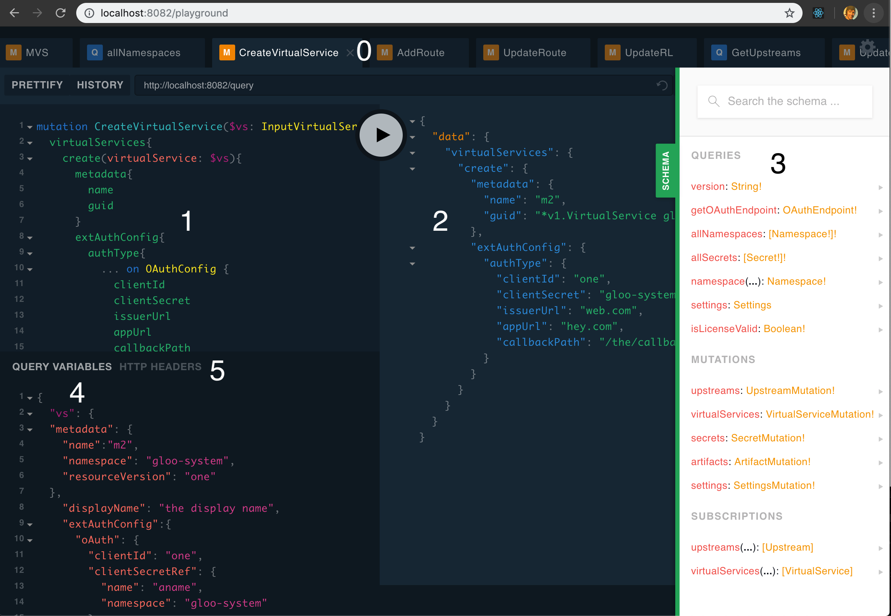

# Run in dev mode
```bash
make record # runs in debug mode, auth disabled, recording enabled
```
By default, it runs on [http://localhost:8082](http://localhost:8082)

# Bypassing authentication
Authentication can be disabled by setting the `NO_AUTH` environment variable to any value. 
This will cause all incoming requests that are missing the `Authorization: Bearer <token>` header 
to use the pod service account to access the Kubernetes resources. Requests that provide a value
for the header will work as usual (i.e. access is restricted to resources accessible by the identity 
associated with the token).

Intended for development use.


# Record queries

- Our regression tests runs several queries to make sure the apiserver is providing the expected api
- To update these queries or gather new ones, you can run the apiserver in "record" mode

## How to capture recorded queries for replay during regression
- **Start GlooE**
  - You can do this in minikube or point your kubectl environment to a cluster that is running glooe
  - Verify that you can access the ui and the graphql playground (typically at `<glooe_addr>/playground`)
- **Start the apiserver locally**
  - The following make target will start the apiserver:
```
cd $SOLO_PROJECTS_DIR/projects/apiserver
make record
```
- **Make some queries in the playground or by interacting with the UI.**
  - Playground:
    - Tip: include an operation name with your queries and it will be recorded too. This can help you sort through the recordings and prune the ones you do not care about.
  - UI:
    - See footnotes
- You can view the queries at `localhost:8082/querylog` or `localhost:8082/querylog/go`
- **Download and write the queries to a go file**
```
cd $SOLO_PROJECTS_DIR/projects/apiserver
NAME=<my_new_records> make create-go-file
# produces: $SOLO_PROJECTS_DIR/projects/apiserver/test/queries/my_new_records.go
```

  - The file will look something like this:

```go
// Code generated by apiserver recorder. DO NOT EDIT.
// id: 6362475465567435311

package queries

// timestamp: 2019-03-28 16:58:45.471886 -0400 EDT m=+14.773026800
const query_6362475465567435311_0 = `{"operationName":null,"variables":{},"query":"{\n  namespace(name: \"gloo-system\") {\n    virtualServices {\n      rateLimitConfig {\n        anonymousLimits {\n          unit\n          requestsPerUnit\n        }\n      }\n    }\n  }\n}\n"}`

// timestamp: 2019-03-28 16:58:48.402245 -0400 EDT m=+17.703385915
const query_6362475465567435311_1 = `{"operationName":"IntrospectionQuery","variables":{},"query":"query IntrospectionQuer...` // Cropped for README

var Queries_6362475465567435311 = []string{
	query_6362475465567435311_0,
	query_6362475465567435311_1,
}
```
- **Add the queries to the regression tests** in `$SOLO_PROJECTS_DIR/test/regressions/gateway/gateway_test.go`
  - Your `my_new_records.go` file will include a single exported list of queries titled `Queries_<random_number>`
  - insert it in `gateway_test.go` by appending it to the `recordedQueries` slice as follows:
```go
			// recordedQueries = append(recordedQueries, qm.Queries_to_be_recorded_later...)
```
- **Notes**
  - You may want to generate a bunch of queries and delete the ones you do not care about.
  - See below for some sample queries
  - Warning about mutations: mutations require valid resource versions. These are not repeatable during query replay. In the future, we may add logic to automatically find the correct resource versions. For now, avoid calling queries that Update or Delete CRDs. (Create and Read work as expected).

## Sample GraphQL Queries for the playground


Playground overview:

0. Tabs for storing other queries
1. Text field for entering queries
2. Results pane (any errors will also be displayed here)
3. Schema browser (very helpful!)
4. Query arguments (required for most mutations, note the syntax)
5. HTTP Headers (not often needed, used for passing authorization header)

Additional tips:
- Can "tab-complete" values for both the query and query arguments
- Can copy query (including arguments) to a `curl` command for cli-based testing (hidden by schema browser window)

### Sample Query
(enter this in field 1)
```graphql
mutation CreateVirtualService($vs: InputVirtualService!){
  virtualServices{
    create(virtualService: $vs){
      metadata{
        name
        guid
      }
      extAuthConfig{
        authType{
          ... on OAuthConfig {
            clientId
            clientSecret
            issuerUrl
            appUrl
            callbackPath
          }
        }
      }
    }
  }
}
```
### Sample Arguments
(enter this in field 4)
```json
{
  "vs": {
  "metadata": {
    "name":"m",
    "namespace": "gloo-system",
    "resourceVersion": "one"
  },
    "displayName": "the display name",
    "extAuthConfig":{
      "oAuth": {
        "clientId": "one",
        "clientSecretRef": {
          "name": "aname",
          "namespace": "gloo-system"
        },
        "issuerUrl": "web.com",
        "appUrl": "hey.com",
        "callbackPath": "/the/callback"
      }
    }
}
}
```
### Sample Expected Result
(will be printed in field 2)
```json
{
  "data": {
    "virtualServices": {
      "create": {
        "metadata": {
          "name": "m",
          "guid": "*v1.VirtualService gloo-system m"
        },
        "extAuthConfig": {
          "authType": {
            "clientId": "one",
            "clientSecret": "gloo-system.aname",
            "issuerUrl": "web.com",
            "appUrl": "hey.com",
            "callbackPath": "/the/callback"
          }
        }
      }
    }
  }
}
```


# Additional Notes
## Running UI in dev-mode
- requires `yarn`
- get the repo: `git clone https://github.com/solo-io/gloo-i`
```
cd $GLOO_UI_REPO_DIR
export REACT_APP_GRAPHQL_ENDPOINT="http://localhost:8082/query"
export REACT_APP_WS_ENDPOINT="ws://localhost:8082/query"
export REACT_APP_GRAFANA_ENDPOINT="http://localhost:8082/query"
export NO_AUTH=1
yarn
yarn bootstrap
yarn build
yarn start
```
